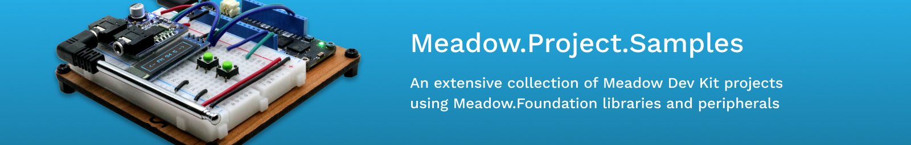
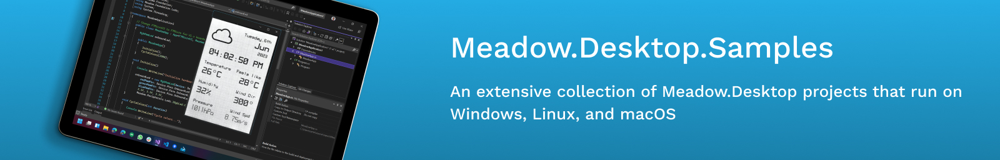

# Meadow.Samples

Sample applications for Meadow platforms, libraries and peripherals.

## Juego

A collection of samples for the Wilderness Labs [Juego IoT Accelerator](https://github.com/WildernessLabs/Juego), an Open-source, Meadow-powered, multigame handheld console with DPads, speakers and a colored display.

### Juego Samples

<table>
    <tr>
        <td>
             
            Getting started with Juego 
            <a href="https://github.com/WildernessLabs/Juego/tree/main/Source/Juego_Demo">Source Code</a>
        </td>
        <td>
             
            Run/play frogger on a Juego 
            <a href="Source/Froggit/">Source Code</a>
        </td>
        <td>
             
            Run/play Tetraminoes on a Juego 
            <a href="Source/Tetraminoes/">Source Code</a>
        </td>
    </tr>
    <tr>
        <td>
             
            Run/play a 2-player Span4 
            <a href="Source/Span4/">Source Code</a>
        </td>
        <td>
             
            Halloween Eye Ball animation 
            <a href="Source/Eyeball/">Source Code</a>
        </td>
        <td>
             
            Run/play snake on a Juego 
            <a href="Source/Snake/">Source Code</a>
        </td> 
    </tr>
    <tr>
        <td>
            
&nbsp;&nbsp;&nbsp;&nbsp;&nbsp;&nbsp;&nbsp;&nbsp;&nbsp;&nbsp;&nbsp;&nbsp;&nbsp;&nbsp;&nbsp;&nbsp;&nbsp;&nbsp;&nbsp;&nbsp;&nbsp;&nbsp;&nbsp;&nbsp;&nbsp;&nbsp;&nbsp;&nbsp;&nbsp;&nbsp;&nbsp;&nbsp;

        </td>
        <td>
            
&nbsp;&nbsp;&nbsp;&nbsp;&nbsp;&nbsp;&nbsp;&nbsp;&nbsp;&nbsp;&nbsp;&nbsp;&nbsp;&nbsp;&nbsp;&nbsp;&nbsp;&nbsp;&nbsp;&nbsp;&nbsp;&nbsp;&nbsp;&nbsp;&nbsp;&nbsp;&nbsp;&nbsp;&nbsp;&nbsp;&nbsp;&nbsp;

        </td>
        <td>
            
&nbsp;&nbsp;&nbsp;&nbsp;&nbsp;&nbsp;&nbsp;&nbsp;&nbsp;&nbsp;&nbsp;&nbsp;&nbsp;&nbsp;&nbsp;&nbsp;&nbsp;&nbsp;&nbsp;&nbsp;&nbsp;&nbsp;&nbsp;&nbsp;&nbsp;&nbsp;&nbsp;&nbsp;&nbsp;&nbsp;&nbsp;&nbsp;

        </td>
    </tr>
</table>

## Meadow.Core

* [Blinky (C#, F#, VB.NET)](./Source/Blinky) 
* [Bluetooth](./Source/Bluetooth/Bluetooth_Basics/)
* [Board Specific Samples](./Source/Board_Specific_Samples)
    * [F7 Feather V2](./Source/Board_Specific_Samples/F7_Micro)
    * [Core Computer Module](./Source/Board_Specific_Samples/CoreComputeBreakout)
* [IO Samples](./Source/IO)
    * [Analog Input Port](./Source/IO/AnalogInputPort)
    * [Bidirectional Port](./Source/IO/BiDirectonalPort)
    * [Counter](./Source/IO/Counter)
    * [Digital Input Port](./Source/IO/DigitalInputPort)
    * [Digital Input Port (Observable)](./Source/IO/DigitalInputPort_IObservable)
    * [GPIO Interrogation](./Source/IO/GpioInterrogation)
    * [Hello LED](./Source/IO/Hello_LED)
    * [Hello LED (F#)](./Source/IO/HelloLED_F%23)
    * [I2C](./Source/IO/I2C)
    * [PWM](./Source/IO/PWM)
    * [Serial Listener](./Source/IO/SerialListener)
    * [Serial Message Port](./Source/IO/SerialMessagePort)
    * [Serial Port](./Source/IO/SerialPort)
    * [Serial Port Echo](./Source/IO/SerialPort_Echo)
    * [SPI](./Source/IO/SPI)
* [Json Basics](./Source/Json_Basics)
* [Network](./Source/Network)
    * [Antenna Switching](./Source/Network/Antenna_Switching)
    * [HttpListener Basics](./Source/Network/HttpListener_Basics)
    * [WIFI Basics](./Source/Network/WiFi_Basics)
* [OS](./Source/OS)
    * [Battery Level](./Source/OS/BatteryLevel)
    * [BeginInvokeOnMainThread](./Source/OS/BeginInvokeOnMainThread)
    * [Config Files](./Source/OS/Config_Files)
    * [File System Basics](./Source/OS/FileSystem_Basics)
    * [Logging](./Source/OS/Logging)
    * [MCU Temperature](./Source/OS/McuTemp)
    * [Power Manager](./Source/OS/Power_Manager)
    * [Real Time Clock](./Source/OS/RealTimeClock)
    * [SDCard](./Source/OS/SDCard/CS)
    * [SQLite](./Source/OS/SQLite)
    * [Threading](./Source/OS/Threading)
    * [Threading.Tasks](./Source/OS/Threading.Tasks)
    * [Update](./Source/OS/Update)
    * [Watchdog](./Source/OS/Watchdog)
* [Walking Digital Outputs](./Source/Utilities/Walking_DigitalOutputs)

## Single-Board-Computers

Public project samples for [Single-Board-Computers (SBCs)](https://developer.wildernesslabs.co/Meadow/Getting_Started/SBCs/). Click on any of these sample project to learn how they work and run them on a Raspberry Pi, SeeedStudio reTerminal and/or Nvidia Jetson Nano.

### Single-Board-Computer Samples

<table>
    <tr>
        <td>
             
            Getting started with a Blinky app on a Raspberry Pi 
            <a href="Source/Blinky/">Source Code</a>
        </td>
        <td>
             
            Using a 20x4 LCD Character Display on a Raspberry Pi 
            <a href="Source/CharacterDisplaySample/">Source Code</a>
        </td>
        <td>
             
            Using MicroGraphics on a ST7789 display on a Raspberry Pi 
            <a href="Source/ST7789_Sample/">Source Code</a>
        </td>
    </tr>
    <tr>
        <td>
             
            Build a weather widget using MicroLayout on a Raspberry Pi 
            <a href="Source/WifiWeather/">Source Code</a>
        </td>
        <td>
             
            Using a BME280 atmospheric sensor on a Raspberry Pi 
            <a href="Source/Bme280_Sample/">Source Code</a>
        </td>
        <td>
             
            Working with push button events on a Rapsberry Pi 
            <a href="Source/Linux/WifiWeather/">Source Code</a>
        </td>
    </tr>
    <tr>
        <td>
            
&nbsp;&nbsp;&nbsp;&nbsp;&nbsp;&nbsp;&nbsp;&nbsp;&nbsp;&nbsp;&nbsp;&nbsp;&nbsp;&nbsp;&nbsp;&nbsp;&nbsp;&nbsp;&nbsp;&nbsp;&nbsp;&nbsp;&nbsp;&nbsp;&nbsp;&nbsp;&nbsp;&nbsp;&nbsp;&nbsp;&nbsp;&nbsp;

        </td>
        <td>
            
&nbsp;&nbsp;&nbsp;&nbsp;&nbsp;&nbsp;&nbsp;&nbsp;&nbsp;&nbsp;&nbsp;&nbsp;&nbsp;&nbsp;&nbsp;&nbsp;&nbsp;&nbsp;&nbsp;&nbsp;&nbsp;&nbsp;&nbsp;&nbsp;&nbsp;&nbsp;&nbsp;&nbsp;&nbsp;&nbsp;&nbsp;&nbsp;

        </td>
        <td>
            
&nbsp;&nbsp;&nbsp;&nbsp;&nbsp;&nbsp;&nbsp;&nbsp;&nbsp;&nbsp;&nbsp;&nbsp;&nbsp;&nbsp;&nbsp;&nbsp;&nbsp;&nbsp;&nbsp;&nbsp;&nbsp;&nbsp;&nbsp;&nbsp;&nbsp;&nbsp;&nbsp;&nbsp;&nbsp;&nbsp;&nbsp;&nbsp;

        </td>
    </tr>
</table>

## Meadow.Cloud

Meadow.Cloud provides secure, Over-the-Air (OtA) updates, which enable you to push a new version of a Meadow application to a device in the field over the network. Before running any of the project samples below, make sure to go through the [Meadow.Cloud basics](https://developer.wildernesslabs.co/Meadow/Meadow.Cloud/) guides showing you how to provision your device, how to download and apply an update from Meadow, and make/publish a package. 

## Meadow.Cloud Samples

<table>
    </tr>
        <tr>
        <td>
             
            Send an over-the-air update to change colors on an RGB LED 
            <a href="Source/RgbLedUpdateSample/">Source Code</a>
        </td>
        <td>
             
            Send diagnostics logs from Meadow to Meadow.Cloud 
            <a href="Source/CloudLogging/">Source Code</a>
        </td>
        <td>
             
            Check your Meadow's Health Metrics on Meadow.Cloud 
            <a href="Source/HealthMetricsMonitoring/">Source Code</a>
        </td>
    </tr>
    <tr>
        <td>
             
            Send environmental data to Meadow.Cloud using Log Event 
            <a href="Source/Meadow.Cloud_Logging/">Source Code</a>
        </td>
        <td>
             
            Use Meadow.Cloud to push Over-the-air Updates 
            <a href="Source/Meadow.Cloud_OTA/">Source Code</a>
        </td>
        <!--<td>
             
            Get log event data from Meadow.Cloud using its client API 
            <a href="Source/Meadow.Cloud_Client/">Source Code</a>
        </td>-->
        <td>
             
            Use Meadow.Cloud commands to control a four channel relay 
            <a href="Source/Meadow.Cloud_Command/">Source Code</a>
        </td> 
    </tr>
    <tr>
        <td>
            
&nbsp;&nbsp;&nbsp;&nbsp;&nbsp;&nbsp;&nbsp;&nbsp;&nbsp;&nbsp;&nbsp;&nbsp;&nbsp;&nbsp;&nbsp;&nbsp;&nbsp;&nbsp;&nbsp;&nbsp;&nbsp;&nbsp;&nbsp;&nbsp;&nbsp;&nbsp;&nbsp;&nbsp;&nbsp;&nbsp;&nbsp;&nbsp;

        </td>
        <td>
            
&nbsp;&nbsp;&nbsp;&nbsp;&nbsp;&nbsp;&nbsp;&nbsp;&nbsp;&nbsp;&nbsp;&nbsp;&nbsp;&nbsp;&nbsp;&nbsp;&nbsp;&nbsp;&nbsp;&nbsp;&nbsp;&nbsp;&nbsp;&nbsp;&nbsp;&nbsp;&nbsp;&nbsp;&nbsp;&nbsp;&nbsp;&nbsp;

        </td>
        <td>
            
&nbsp;&nbsp;&nbsp;&nbsp;&nbsp;&nbsp;&nbsp;&nbsp;&nbsp;&nbsp;&nbsp;&nbsp;&nbsp;&nbsp;&nbsp;&nbsp;&nbsp;&nbsp;&nbsp;&nbsp;&nbsp;&nbsp;&nbsp;&nbsp;&nbsp;&nbsp;&nbsp;&nbsp;&nbsp;&nbsp;&nbsp;&nbsp;

        </td>
    </tr>
</table>

---

---

