# Meadow.Samples

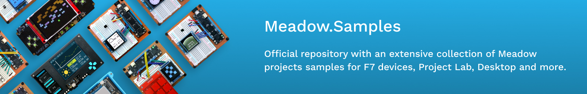

Sample applications for Meadow platforms, libraries and peripherals.

## Contents

* Meadow
    * [Meadow.Desktop](#meadowdesktop)
    * [Meadow F7](#meadow-f7)
    * [Meadow F7 Feather](#meadow-f7-feather)
    * [Raspberry Pi](#raspberry-pi)
* Cloud
    * [Meadow.Cloud](#meadowcloud)
    * [Azure](#azure)
* IoT Accelerators
    * [Project Lab](#project-lab)
    * [Juego](#juego)
    * [GNSS Sensor Tracker](#gnss-sensor-tracker)
    * [Clima](https://github.com/WildernessLabs/Clima)
* Cross-platform
    * [StartKit](#startkit)
* [Support](#support)

## Meadow.Desktop

Public project samples for [Meadow.Windows](http://developer.wildernesslabs.co/Meadow/Getting_Started/Getting_Started_Meadow.Desktop/Getting_Started_Windows/) and [Meadow.Linux](http://developer.wildernesslabs.co/Meadow/Getting_Started/Getting_Started_Meadow.Desktop/Getting_Started_Linux/). Click on any of these sample project to learn how they work and run them straight from your Windows machine or Linux device.

### Windows

#### Connecting sensors and peripherals

If a sample uses a physical peripheral or sensor, you'll need to an FT232H IO Expander to connect to your machine. Also check the pinout to make sure to connect the peripheral or sensor on the right pins:

    

<table>
    <tr>
        <td>
            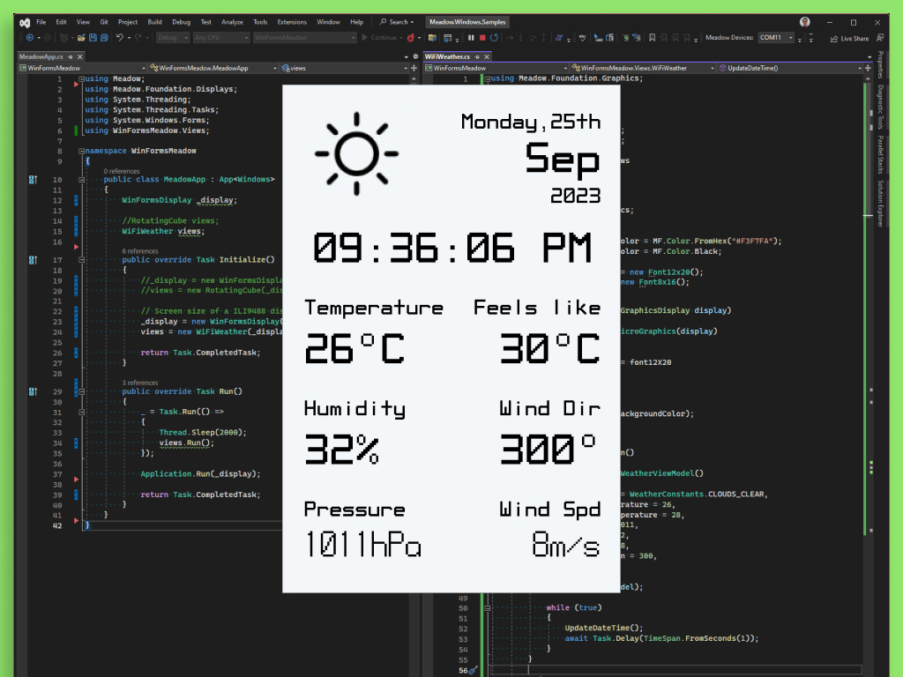 
            Build HMI Screens using Meadow.WinForms 
            <a href="https://www.hackster.io/wilderness-labs/run-meadow-micrographics-on-winforms-directly-from-your-pc-db875b">Hackster</a> | 
            <a href="Source/Meadow.Desktop/WinForms/">Source Code</a>
        </td>
        <td>
             
            Build hardware apps using Meadow in a MAUI app 
            <a href="https://www.hackster.io/wilderness-labs/run-meadow-within-a-maui-windows-application-196d8d">Hackster</a> | 
            <a href="Source/Meadow.Desktop/MauiMeadow/">Source Code</a>
        </td>
        <td>
            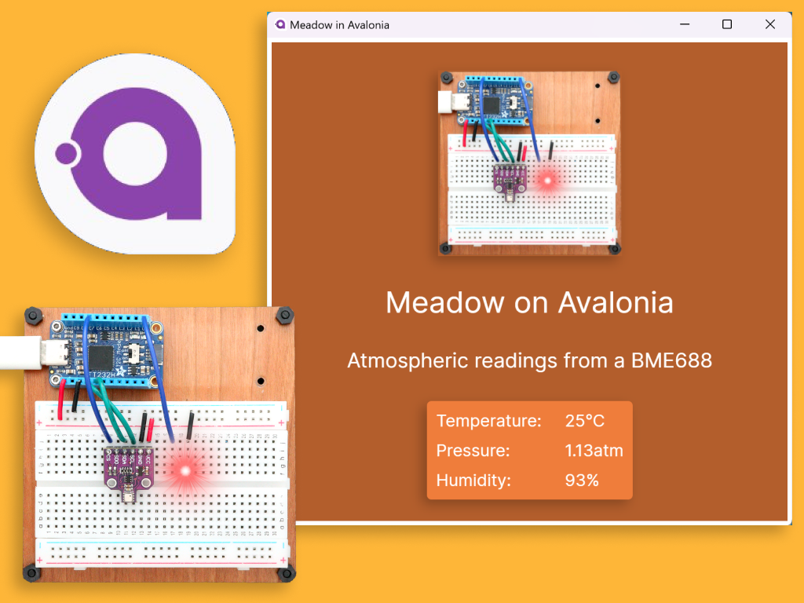 
            Build hardware apps using Meadow in an Avalonia app 
            <a href="https://www.hackster.io/wilderness-labs/run-meadow-within-an-avalonia-application-68371e">Hackster</a> | 
            <a href="Source/Meadow.Desktop/AvaloniaMeadow/">Source Code</a>
        </td>
    </tr>
    <tr>
        <td>
             
            Running Blinky app with an FT232H IO Expander 
            <a href="https://www.hackster.io/wilderness-labs/run-meadow-apps-directly-from-your-pc-using-meadow-windows-dab4bf">Hackster</a> | 
            <a href="Source/Meadow.Desktop/Blinky/">Source Code</a>
        </td>
        <td>
            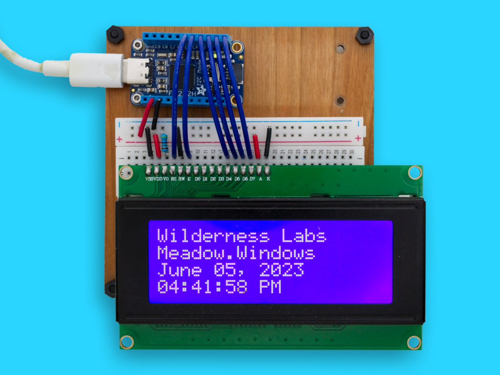 
            Using a Character Display with an FT232H IO Expander 
            <a href="https://www.hackster.io/wilderness-labs/control-an-lcd-display-with-your-pc-using-meadow-windows-186c6d">Hackster</a> | 
            <a href="Source/Meadow.Desktop/CharacterDisplaySample/">Source Code</a>
        </td>
        <td>
             
            Show weather data on a display with an FT232H IO Expander 
            <a href="https://www.hackster.io/wilderness-labs/build-this-weather-widget-running-directly-from-your-pc-57c69f">Hackster</a> | 
            <a href="Source/Meadow.Desktop/WifiWeather/">Source Code</a>
        </td>
    </tr>
    <tr>
        <td>
            
&nbsp;&nbsp;&nbsp;&nbsp;&nbsp;&nbsp;&nbsp;&nbsp;&nbsp;&nbsp;&nbsp;&nbsp;&nbsp;&nbsp;&nbsp;&nbsp;&nbsp;&nbsp;&nbsp;&nbsp;&nbsp;&nbsp;&nbsp;&nbsp;&nbsp;&nbsp;&nbsp;&nbsp;&nbsp;&nbsp;&nbsp;&nbsp;

        </td>
        <td>
            
&nbsp;&nbsp;&nbsp;&nbsp;&nbsp;&nbsp;&nbsp;&nbsp;&nbsp;&nbsp;&nbsp;&nbsp;&nbsp;&nbsp;&nbsp;&nbsp;&nbsp;&nbsp;&nbsp;&nbsp;&nbsp;&nbsp;&nbsp;&nbsp;&nbsp;&nbsp;&nbsp;&nbsp;&nbsp;&nbsp;&nbsp;&nbsp;

        </td>
        <td>
            
&nbsp;&nbsp;&nbsp;&nbsp;&nbsp;&nbsp;&nbsp;&nbsp;&nbsp;&nbsp;&nbsp;&nbsp;&nbsp;&nbsp;&nbsp;&nbsp;&nbsp;&nbsp;&nbsp;&nbsp;&nbsp;&nbsp;&nbsp;&nbsp;&nbsp;&nbsp;&nbsp;&nbsp;&nbsp;&nbsp;&nbsp;&nbsp;

        </td>
    </tr>
</table>

[Back to top](#meadowsamples)

## Meadow F7

* Blinky
    * [C#](./Source/Meadow%20F7/Blinky/BlinkyCS/)
    * [F#](./Source/Meadow%20F7/BlinkyFS/)
    * [VB.NET](./Source/Meadow%20F7/BlinkyVB/) 
* Bluetooth
    * [Bluetooth Basics](./Source/Meadow%20F7/Bluetooth/Bluetooth_Basics/)
* Board Specific Samples
    * [F7 Feather V2](./Source/Meadow%20F7/Board_Specific_Samples/F7_Micro_Board_Diagnostics/)
    * [Core Computer Module](./Source/Meadow%20F7/Board_Specific_Samples/CoreComputeBreakout/)
* IO
    * [Analog Input Array](./Source/Meadow%20F7/IO/AnalogInputArray/)
    * [Analog Input Port](./Source/Meadow%20F7/IO/AnalogInputPort/)
    * [Bidirectional Port](./Source/Meadow%20F7/IO/BiDirectonalPort/)
    * [Digital Input Port](./Source/Meadow%20F7/IO/DigitalInputPort)
    * [Digital Interrupt Port](./Source/Meadow%20F7/IO/DigitalInterruptPort/)
    * [GPIO Interrogation](./Source/Meadow%20F7/IO/GpioInterrogation)
    * [I2C](./Source/Meadow%20F7/IO/I2C)
    * [PWM](./Source/Meadow%20F7/IO/PWM)
    * [Serial Listener](./Source/Meadow%20F7/IO/SerialListener)
    * [Serial Message Port](./Source/Meadow%20F7/IO/SerialMessagePort)
    * [Serial Port](./Source/Meadow%20F7/IO/SerialPort)
    * [Serial Port Echo](./Source/Meadow%20F7/IO/SerialPort_Echo)
    * [SPI](./Source/Meadow%20F7/IO/SPI)
    * [Wake on interrupt](./Source/Meadow%20F7/IO/WakeOnInterrupt/)
* Network
    * [Antenna Switching](./Source/Meadow%20F7/Network/AntennaSwitching/)
    * [Cell Basics](./Source/Meadow%20F7/Network/Cell_Basics/)
    * [Ethernet Basics](./Source/Meadow%20F7/Network/Ethernet_Basics/)
    * [HttpListener Basics](./Source/Meadow%20F7/Network/HttpListener_Basics/)
    * [TLS Client](./Source/Meadow%20F7/Network/TLS_Client_Authentication/)
    * [WIFI Basics](./Source/Meadow%20F7/Network/WiFi_Basics/)
    * [WIFI Config](./Source/Meadow%20F7/Network/WiFiConfig/)
* NTP
    * [NtpSample](./Source/Meadow%20F7/NTP/NtpSample/)
* OS
    * [Battery Level](./Source/Meadow%20F7/OS/BatteryLevel/)
    * [Charge State](./Source/Meadow%20F7/OS/ChargeState/)
    * [Config Files](./Source/Meadow%20F7/OS/ConfigFiles/)
    * [Crash Detection](./Source/Meadow%20F7/OS/CrashDetect/)
    * [File System Basics](./Source/Meadow%20F7/OS/FileSystem_Basics/)
    * [Json Basics](./Source/Meadow%20F7/OS/Json_Basics/)
    * [Logging](./Source/Meadow%20F7/OS/Logging)
    * [MCU Temperature](./Source/Meadow%20F7/OS/McuTemp)
    * [OS Telemetry](./Source/Meadow%20F7/OS/OS_Telemetry/)
    * [Power Manager](./Source/Meadow%20F7/OS/PowerManager/)
    * [Real Time Clock](./Source/Meadow%20F7/OS/RealTimeClock)
    * [Resolver Services](./Source/Meadow%20F7/OS/ResolverServices/)
    * [SDCard](./Source/Meadow%20F7/OS/SDCard/)
    * [SQLite Basics](./Source/Meadow%20F7/OS/SQLite_Basics/)
    * [Tasks Basics](./Source/Meadow%20F7/OS/Tasks_Basics/)
    * [Threading Basics](./Source/Meadow%20F7/OS/Threading_Basics/)
    * [Watchdog](./Source/Meadow%20F7/OS/Watchdog/)
* Utilities
    * [Walking_DigitalOutputs](./Source/Meadow%20F7/Utilities/WalkingDigitalOutputs/)
    * [Walking_DigitalOutputs F#](./Source/Meadow%20F7/Utilities/WalkingDigitalOutputs_F#/)

[Back to top](#meadowsamples)

## Meadow F7 Feather

[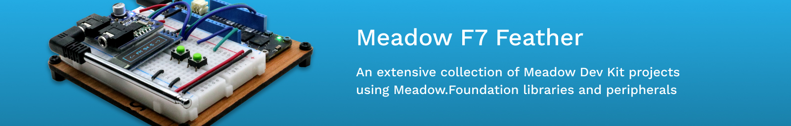](/Source/Meadow.Project.Samples/)

Public project samples for Meadow and Meadow.Foundation. Click on any of the projects below to go to the Hackster projects and learn how to build them.

<table>
    <tr>
        <td>
             
            Weather Station Using Public Web Service using Meadow 
            <a href="https://www.hackster.io/wilderness-labs/weather-station-using-public-web-service-using-meadow-e47765">Hackster</a> | 
            <a href="Source/Meadow F7 Feather/WifiWeather/">Source Code</a>
        </td>
        <td>
             
            Meadow Rover Part 2: Remote Control over Bluetooth 
            <a href="https://www.hackster.io/wilderness-labs/meadow-rover-part-2-remote-control-over-bluetooth-fe43f5">Hackster</a> | 
            <a href="Source/Meadow F7 Feather/Rover/MeadowRoverBle/">Source Code</a>
        </td>
        <td>
             
            Configure Meadow's WIFI over Bluetooth 
            <a href="https://www.hackster.io/wilderness-labs/configure-meadow-s-wifi-over-bluetooth-c2841e">Hackster</a> | 
            <a href="Source/Meadow F7 Feather/WiFi/MeadowWifi/">Source Code</a>
        </td>
    </tr>
    <tr>
        <td>
             
            Control a RGB LED with Meadow and MAUI using Bluetooth 
            <a href="https://www.hackster.io/wilderness-labs/control-an-rgb-led-via-bluetooth-with-meadow-and-xamarin-9b2af3">Hackster</a> | 
            <a href="Source/Meadow F7 Feather/Bluetooth/MeadowBleLed/">Source Code</a>
        </td>
        <td>
             
            Control a Servo with Meadow and MAUI using Bluetooth 
            <a href="https://www.hackster.io/wildernesslabs/control-a-servo-via-bluetooth-with-meadow-and-xamarin-57940a">Hackster</a> | 
            <a href="Source/Meadow F7 Feather/Bluetooth/MeadowBleServo/">Source Code</a>
        </td>
        <td>
             
            Get temperature with Meadow and MAUI using Bluetooth 
            <a href="https://www.hackster.io/wilderness-labs/get-temperature-data-via-bluetooth-with-meadow-and-maui-app-397fb8">Hackster</a> | 
            <a href="Source/Meadow F7 Feather/Bluetooth/MeadowBleTemperature/">Source Code</a>
        </td>
    </tr>
    <tr>
        <td>
             
            Control a RGB LED with Meadow and MAUI using REST 
            <a href="https://www.hackster.io/wilderness-labs/remotely-control-an-rgb-led-with-meadow-and-xamarin-w-rest-153a28">Hackster</a> | 
            <a href="Source/Meadow F7 Feather/Maple/MeadowMapleLed/">Source Code</a>
        </td>
        <td>
             
            Control a Servo with Meadow and MAUI using REST 
            <a href="https://www.hackster.io/wilderness-labs/remote-control-a-servo-with-meadow-and-xamarin-using-rest-063cb0">Hackster</a> | 
            <a href="Source/Meadow F7 Feather/Maple/MeadowMapleServo/">Source Code</a>
        </td>
        <td>
         
            Get temperature logs with Meadow and MAUI using REST 
            <a href="https://www.hackster.io/wilderness-labs/get-temperature-logs-with-meadow-and-maui-using-rest-e529df">Hackster</a> | 
            <a href="Source/Meadow F7 Feather/Maple/MeadowMapleTemperature/">Source Code</a>
        </td>
    </tr>
    <tr>
        <td>
            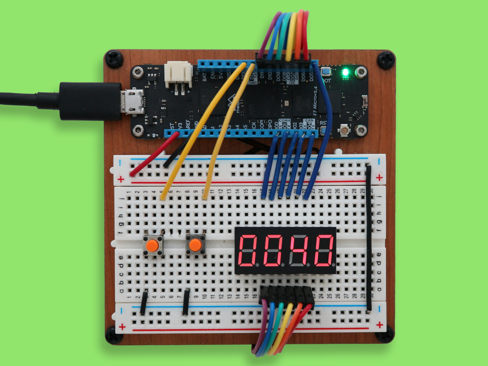 
            Build a Stopwatch using buttons and display with Meadow 
            <a href="https://www.hackster.io/wilderness-labs/build-a-stopwatch-using-buttons-and-display-with-meadow-168011">Hackster</a> | 
            <a href="Source/Hackster/LedDice/">Source Code</a>
        </td>
        <td>
             
            Working with Graphics on a ST7789 display using Meadow 
            <a href="https://www.hackster.io/wilderness-labs/working-with-graphics-on-a-st7789-display-using-meadow-e2295a">Hackster</a> | 
            <a href="Source/Meadow F7 Feather/AnalogWatchFace/">Source Code</a>
        </td>
        <td>
             
            Make an Image Gallery with an ST7789 display and Meadow 
            <a href="https://www.hackster.io/wilderness-labs/make-an-image-gallery-with-an-st7789-display-and-meadow-a80f5c">Hackster</a> | 
            <a href="Source/Meadow F7 Feather/GalleryViewer/">Source Code</a>
        </td>
    </tr>
    <tr>
        <td>
             
            Make an indoor/outdoor temperature/weather desk clock 
            <a href="https://www.hackster.io/wilderness-labs/make-a-meadow-indoor-outdoor-temperature-weather-desk-clock-463839">Hackster</a> | 
            <a href="Source/Meadow F7 Feather/WifiWeatherClock/">Source Code</a>
        </td>
        <td>
             
            Build a WIFI Connected Clock/Temp sensor using Meadow 
            <a href="https://www.hackster.io/wilderness-labs/build-a-wifi-connected-clock-using-meadow-e0c6b6">Hackster</a> | 
            <a href="Source/Meadow F7 Feather/WifiClock/">Source Code</a>
        </td>
        <td>
             
            Light up LEDs with a accelerometer sensor using Meadow 
            <a href="https://www.hackster.io/wilderness-labs/make-a-basic-level-with-an-mpu6050-four-leds-and-meadow-53a883">Hackster</a> | 
            <a href="Source/Meadow F7 Feather/RotationDetector/">Source Code</a>
        </td>
    </tr>
    <tr>
        <td>
             
            Build Your a Temperature Monitor with Meadow 
            <a href="https://www.hackster.io/wilderness-labs/build-your-own-temperature-monitor-with-meadow-edc696">Hackster</a> | 
            <a href="Source/Meadow F7 Feather/TemperatureMonitor/">Source Code</a>
        </td>
        <td>
             
            Control a LedBar using a Rotary Encoder with Meadow 
            <a href="https://www.hackster.io/wilderness-labs/control-a-ledbar-using-a-rotary-encoder-with-meadow-30efeb">Hackster</a> | 
            <a href="Source/Meadow F7 Feather/RotaryLedBar/">Source Code</a>
        </td>
        <td>
             
            Build Your Own Simon Game with Meadow 
            <a href="https://www.hackster.io/wilderness-labs/build-your-own-simon-game-with-meadow-3701d5">Hackster</a> | 
            <a href="Source/Meadow F7 Feather/Simon/">Source Code</a>
        </td>
    </tr>
    <tr>
        <td>
             
            Expanding IO Ports on Meadow with an MCP23008 
            <a href="https://www.hackster.io/wilderness-labs/expanding-io-ports-on-meadow-with-an-mcp23008-23a512">Hackster</a> | 
            <a href="Source/Meadow F7 Feather/McpLeds/">Source Code</a>
        </td>
        <td>
             
            Build Smart Holiday Lights with RGB LED Strips 
            <a href="https://www.hackster.io/wilderness-labs/build-smart-holiday-lights-with-rgb-led-strips-using-meadow-1b0f53">Hackster</a> | 
            <a href="Source/Meadow F7 Feather/HolidayLedStrips/">Source Code</a>
        </td>
        <td>
             
            Expanding IO Ports of a Meadow with a 74HC595 
            <a href="https://www.hackster.io/wilderness-labs/expanding-io-ports-of-a-meadow-with-a-74hc595-dde681">Hackster</a> | 
            <a href="Source/Meadow F7 Feather/ShiftRegisterLeds/">Source Code</a>
        </td>
    </tr>
    <tr>
        <td>
             
            Build an FM Radio Player Using Meadow 
            <a href="https://www.hackster.io/wilderness-labs/build-an-fm-radio-player-with-meadow-8c0a63">Hackster</a> | 
            <a href="Source/Meadow F7 Feather/RadioPlayer/">Source Code</a>
        </td>
        <td>
             
            Control a Servo with a Rotary Encoder Using Meadow 
            <a href="https://www.hackster.io/wilderness-labs/control-a-servo-with-a-rotary-encoder-using-meadow-47c003">Hackster</a> | 
            <a href="Source/Meadow F7 Feather/RotaryServo/">Source Code</a>
        </td>
        <td>
             
            Build an Interactive Menu with TextDisplayMenu 
            <a href="https://www.hackster.io/wilderness-labs/build-an-interactive-menu-with-textdisplaymenu-using-meadow-218884">Hackster</a> | 
            <a href="Source/Meadow F7 Feather/MeadowMenu/">Source Code</a>
        </td>
    </tr>
    <tr>
        <td>
             
            Meadow Rover Part 1: Motor Control with directional LEDs 
            <a href="https://www.hackster.io/wilderness-labs/meadow-rover-part-1-motor-control-with-directional-leds-85107d">Hackster</a> | 
            <a href="Source/Meadow F7 Feather/Rover/MeadowRoverLeds">Source Code</a>
        </td>
        <td>
             
            Build an Obstacle Radar with a distance sensor and MicroGraphics 
            <a href="https://www.hackster.io/wilderness-labs/build-an-obstacle-radar-with-meadow-d9bf2e">Hackster</a> | 
            <a href="Source/Meadow F7 Feather/ObstacleRadar/">Source Code</a>
        </td>
        <td>
             
            Build a Clock with Meadow's Onboard Real Time Clock Chip 
            <a href="https://www.hackster.io/wilderness-labs/build-a-clock-with-meadow-s-onboard-real-time-clock-chip-2b1f85">Hackster</a> | 
            <a href="Source/Meadow F7 Feather/LcdDisplayClock/">Source Code</a>
        </td>
    </tr>
    <tr>
        <td>
             
            Working with a Touch Keypad and SPI Display 
            <a href="https://www.hackster.io/wilderness-labs/working-with-a-touch-keypad-and-spi-display-using-meadow-ddb040">Hackster</a> | 
            <a href="Source/Meadow F7 Feather/TouchKeypad/">Source Code</a>
        </td>
        <td>
             
            WIFI Christmas Countdown Timer with a LCD 
            <a href="https://www.hackster.io/wilderness-labs/wifi-christmas-countdown-timer-w-an-lcd-display-and-meadow-e4cf9c">Hackster</a> | 
            <a href="Source/Meadow F7 Feather/DateCountdown/">Source Code</a>
        </td>
        <td>
             
            Using a 2-Axis Analog Joystick with Meadow 
            <a href="https://www.hackster.io/wilderness-labs/using-a-2-axis-analog-joystick-with-meadow-e3188e">Hackster</a> | 
            <a href="Source/Meadow F7 Feather/LedJoystick/">Source Code</a>
        </td>
    </tr>
    <tr>
        <td>
            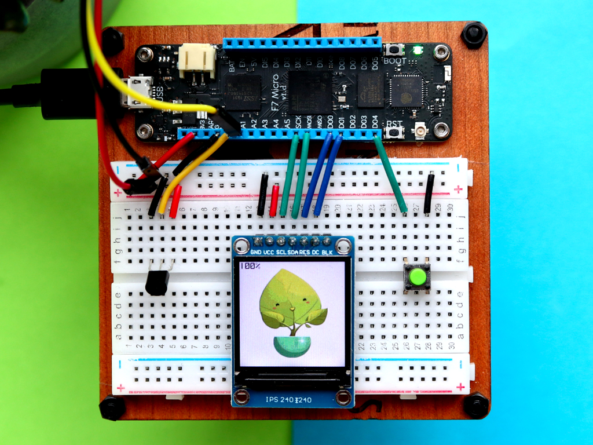 
            Build Your Own Plant Monitor Using Meadow 
            <a href="https://www.hackster.io/wilderness-labs/build-your-own-plant-monitor-using-meadow-5a4b6c">Hackster</a> | 
            <a href="Source/Meadow F7 Feather/PlantMonitor/">Source Code</a>
        </td>
        <td>
            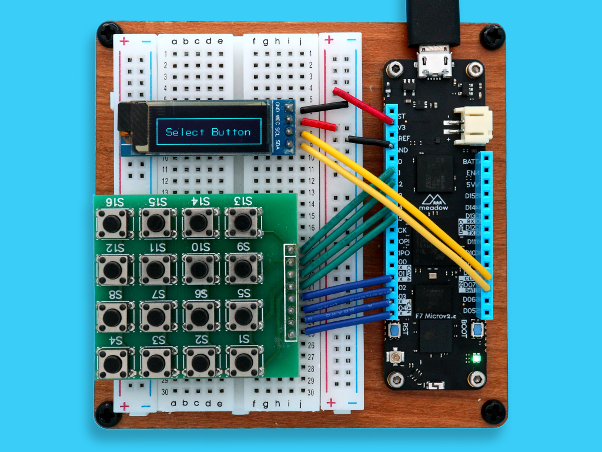 
            Build your own Memory Game with Meadow 
            <a href="https://www.hackster.io/wilderness-labs/build-your-own-memory-game-with-meadow-a40933">Hackster</a> | 
            <a href="Source/Meadow F7 Feather/MemoryGame/">Source Code</a>
        </td>
        <td>
            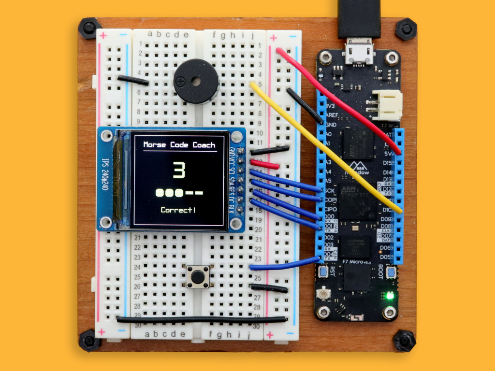 
            Train your Morse Code spelling skills with Meadow 
            <a href="https://www.hackster.io/wilderness-labs/train-your-morse-code-spelling-skills-with-meadow-3f2d9e">Hackster</a> | 
            <a href="Source/Meadow F7 Feather/MorseCodeTrainer/">Source Code</a>
        </td>
    </tr>
    <tr>
        <td>
            
&nbsp;&nbsp;&nbsp;&nbsp;&nbsp;&nbsp;&nbsp;&nbsp;&nbsp;&nbsp;&nbsp;&nbsp;&nbsp;&nbsp;&nbsp;&nbsp;&nbsp;&nbsp;&nbsp;&nbsp;&nbsp;&nbsp;&nbsp;&nbsp;&nbsp;&nbsp;&nbsp;&nbsp;&nbsp;&nbsp;&nbsp;&nbsp;

        </td>
        <td>
            
&nbsp;&nbsp;&nbsp;&nbsp;&nbsp;&nbsp;&nbsp;&nbsp;&nbsp;&nbsp;&nbsp;&nbsp;&nbsp;&nbsp;&nbsp;&nbsp;&nbsp;&nbsp;&nbsp;&nbsp;&nbsp;&nbsp;&nbsp;&nbsp;&nbsp;&nbsp;&nbsp;&nbsp;&nbsp;&nbsp;&nbsp;&nbsp;

        </td>
        <td>
            
&nbsp;&nbsp;&nbsp;&nbsp;&nbsp;&nbsp;&nbsp;&nbsp;&nbsp;&nbsp;&nbsp;&nbsp;&nbsp;&nbsp;&nbsp;&nbsp;&nbsp;&nbsp;&nbsp;&nbsp;&nbsp;&nbsp;&nbsp;&nbsp;&nbsp;&nbsp;&nbsp;&nbsp;&nbsp;&nbsp;&nbsp;&nbsp;

        </td>
    </tr>
</table>

[Back to top](#meadowsamples)

## Raspberry Pi

[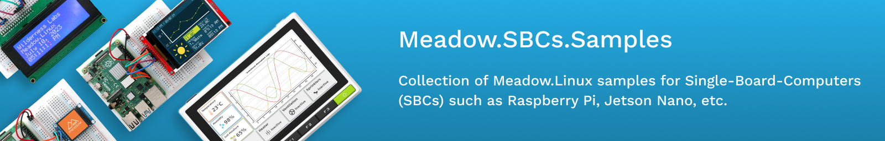](/Source/RaspberryPi/)

Public project samples for [Single-Board-Computers (SBCs)](https://developer.wildernesslabs.co/Meadow/Getting_Started/SBCs/). Click on any of these sample project to learn how they work and run them on a Raspberry Pi, SeeedStudio reTerminal and/or Nvidia Jetson Nano.

<table>
    <tr>
        <td>
            <a href="Source/RaspberryPi/Blinky/">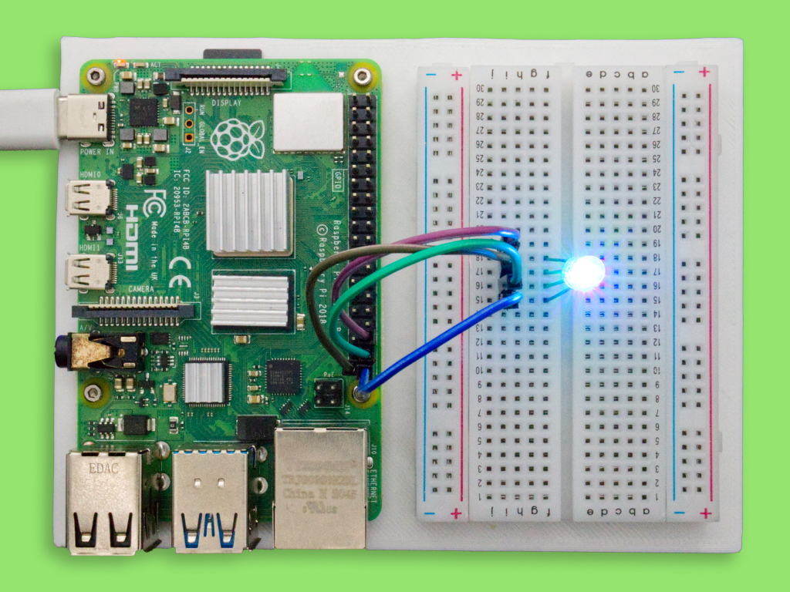</a> 
            Getting started with a Blinky app on a Raspberry Pi 
            <a href="Source/RaspberryPi/Blinky/">Source Code</a>
        </td>
        <td>
            <a href="Source/RaspberryPi/CharacterDisplaySample/">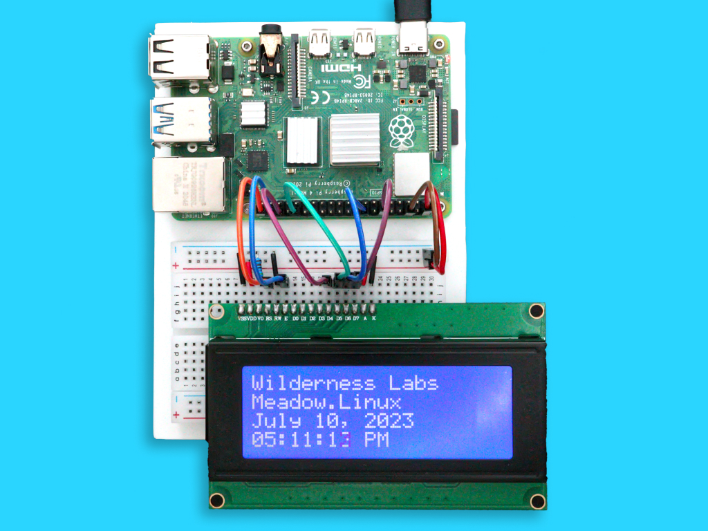</a> 
            Using a 20x4 LCD Character Display on a Raspberry Pi 
            <a href="Source/RaspberryPi/CharacterDisplaySample/">Source Code</a>
        </td>
        <td>
            <a href="Source/RaspberryPi/ST7789_Sample/">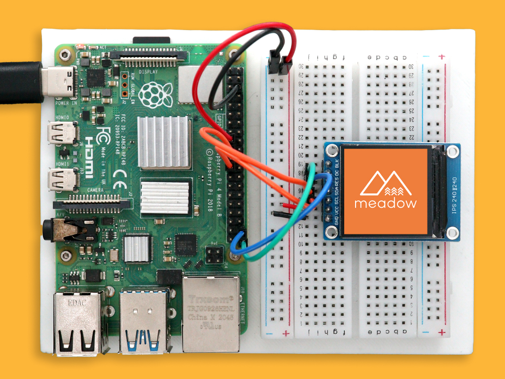</a> 
            Using MicroGraphics on a ST7789 display on a Raspberry Pi 
            <a href="Source/RaspberryPi/ST7789_Sample/">Source Code</a>
        </td>
    </tr>
    <tr>
        <td>
            <a href="Source/RaspberryPi/WifiWeather/">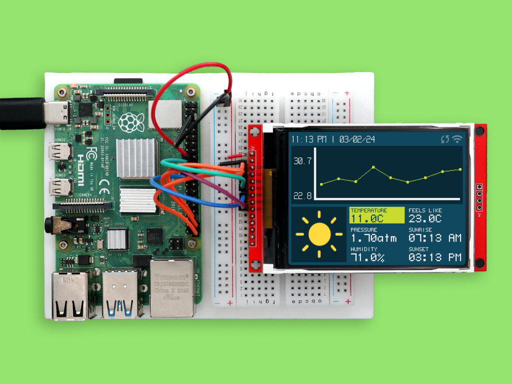</a> 
            Build a weather widget using MicroLayout on a Raspberry Pi 
            <a href="Source/RaspberryPi/WifiWeather/">Source Code</a>
        </td>
        <td>
             
            Using a BME280 atmospheric sensor on a Raspberry Pi 
            <a href="Source/RaspberryPi/Bme280_Sample/">Source Code</a>
        </td>
        <td>
            <a href="Source/RaspberryPi/WifiWeather/">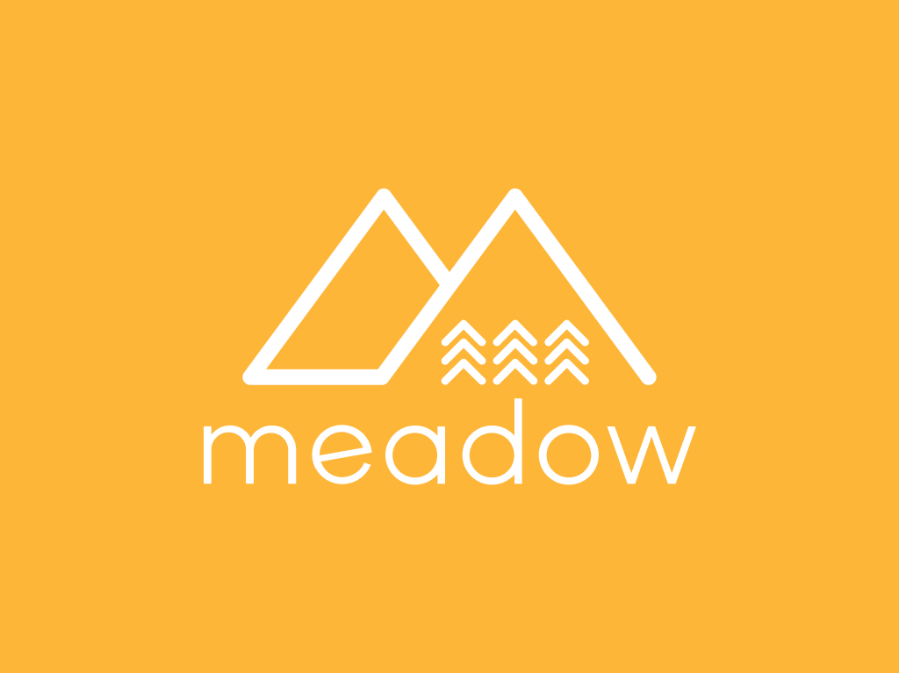</a> 
            Working with push button events on a Rapsberry Pi 
            <a href="Source/RaspberryPi/WifiWeather/">Source Code</a>
        </td>
    </tr>
    <tr>
        <td>
            
&nbsp;&nbsp;&nbsp;&nbsp;&nbsp;&nbsp;&nbsp;&nbsp;&nbsp;&nbsp;&nbsp;&nbsp;&nbsp;&nbsp;&nbsp;&nbsp;&nbsp;&nbsp;&nbsp;&nbsp;&nbsp;&nbsp;&nbsp;&nbsp;&nbsp;&nbsp;&nbsp;&nbsp;&nbsp;&nbsp;&nbsp;&nbsp;

        </td>
        <td>
            
&nbsp;&nbsp;&nbsp;&nbsp;&nbsp;&nbsp;&nbsp;&nbsp;&nbsp;&nbsp;&nbsp;&nbsp;&nbsp;&nbsp;&nbsp;&nbsp;&nbsp;&nbsp;&nbsp;&nbsp;&nbsp;&nbsp;&nbsp;&nbsp;&nbsp;&nbsp;&nbsp;&nbsp;&nbsp;&nbsp;&nbsp;&nbsp;

        </td>
        <td>
            
&nbsp;&nbsp;&nbsp;&nbsp;&nbsp;&nbsp;&nbsp;&nbsp;&nbsp;&nbsp;&nbsp;&nbsp;&nbsp;&nbsp;&nbsp;&nbsp;&nbsp;&nbsp;&nbsp;&nbsp;&nbsp;&nbsp;&nbsp;&nbsp;&nbsp;&nbsp;&nbsp;&nbsp;&nbsp;&nbsp;&nbsp;&nbsp;

        </td>
    </tr>
</table>

[Back to top](#meadowsamples)

## Meadow.Cloud

Meadow.Cloud provides secure, Over-the-Air (OtA) updates, which enable you to push a new version of a Meadow application to a device in the field over the network. Before running any of the project samples below, make sure to go through the [Meadow.Cloud basics](https://developer.wildernesslabs.co/Meadow/Meadow.Cloud/) guides showing you how to provision your device, how to download and apply an update from Meadow, and make/publish a package. 

<table>
    <tr>
        <td>
            <a href="Source/Meadow.Cloud/FeatherF7_OTA/">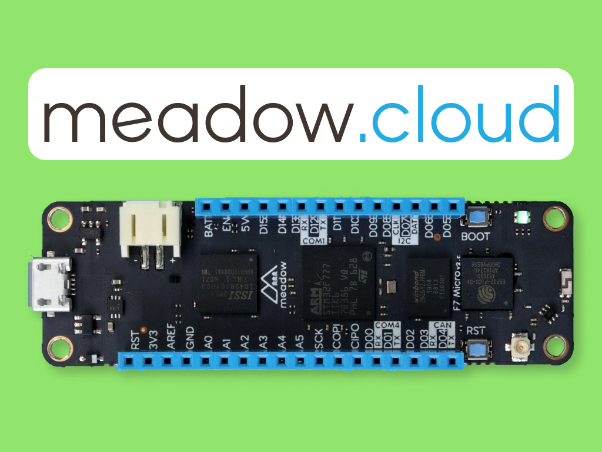</a> 
            Send an over-the-air update to change colors on an RGB LED 
            <a href="Source/Meadow.Cloud/FeatherF7_OTA/">Source Code</a>
        </td>
        <td>
            <a href="Source/Meadow.Cloud/MeadowF7_Logging/">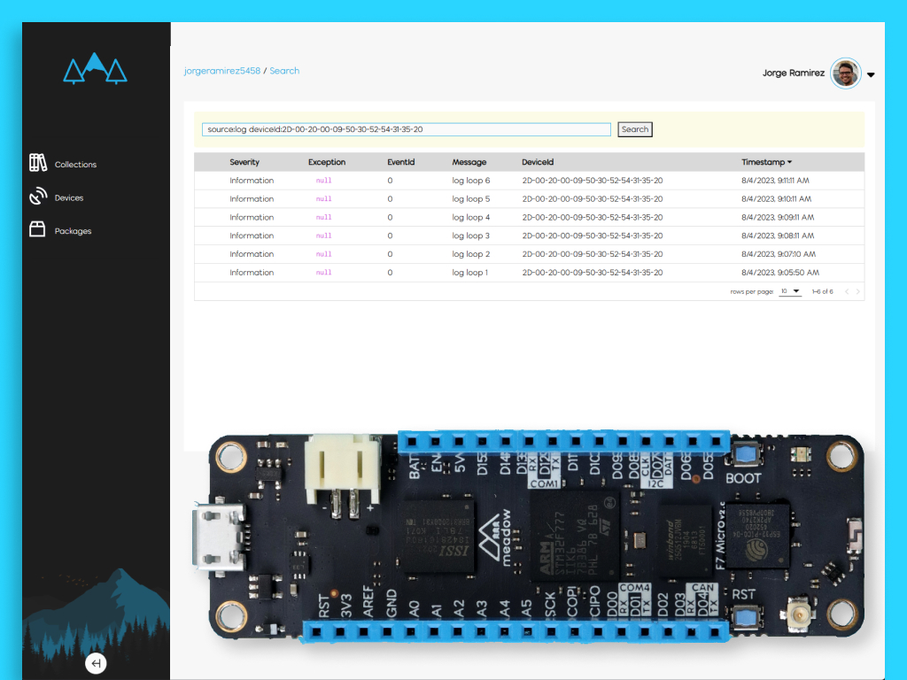</a> 
            Send diagnostics logs from Meadow to Meadow.Cloud 
            <a href="Source/Meadow.Cloud/MeadowF7_Logging/">Source Code</a>
        </td>
        <td>
            <a href="Source/Meadow.Cloud/MeadowF7_HealthMetrics/">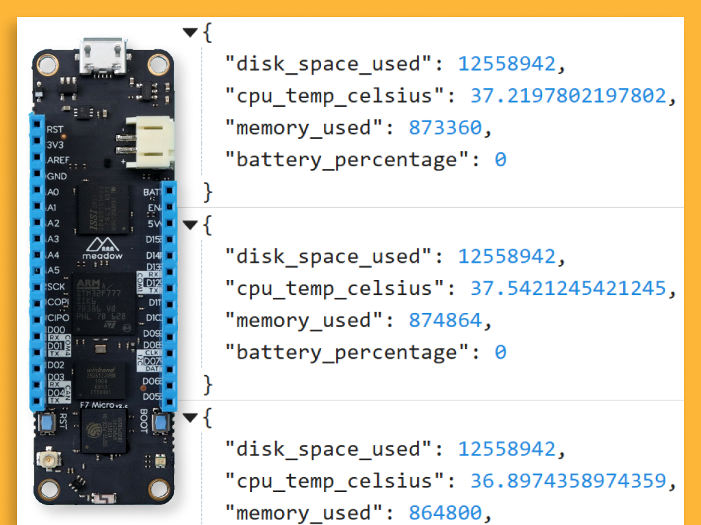</a> 
            Check your Meadow's Health Metrics on Meadow.Cloud 
            <a href="Source/Meadow.Cloud/MeadowF7_HealthMetrics/">Source Code</a>
        </td>
    </tr>
    <tr>
        <td>
            <a href="Source/Meadow.Cloud/ProjectLab_Logging/">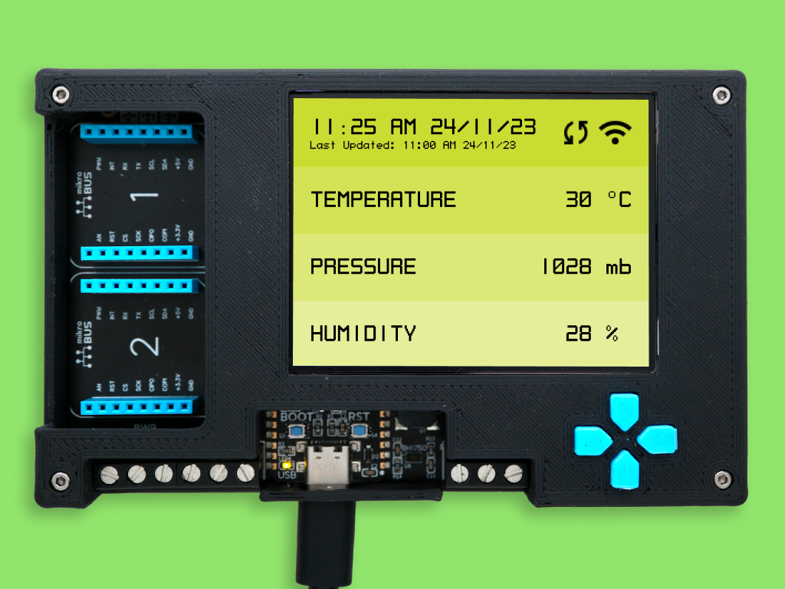</a> 
            Send environmental data to Meadow.Cloud using Log Event 
            <a href="Source/Meadow.Cloud/ProjectLab_Logging/">Source Code</a>
        </td>
        <td>
            <a href="Source/Meadow.Cloud/ProjectLab_OTA/">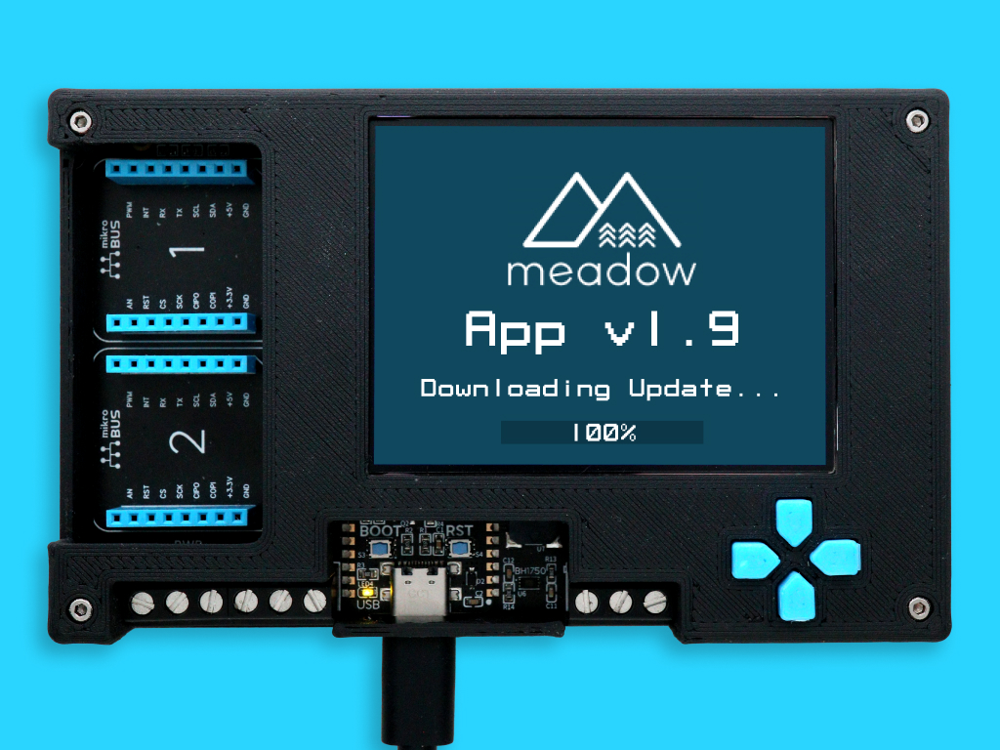</a> 
            Use Meadow.Cloud to push Over-the-air Updates 
            <a href="Source/Meadow.Cloud/ProjectLab_OTA/">Source Code</a>
        </td>
        <td>
             
            Use Meadow.Cloud commands to control a four channel relay 
            <a href="Source/Meadow.Cloud/ProjectLab_Command/">Source Code</a>
        </td> 
    </tr>
    <tr>
        <td>
            
&nbsp;&nbsp;&nbsp;&nbsp;&nbsp;&nbsp;&nbsp;&nbsp;&nbsp;&nbsp;&nbsp;&nbsp;&nbsp;&nbsp;&nbsp;&nbsp;&nbsp;&nbsp;&nbsp;&nbsp;&nbsp;&nbsp;&nbsp;&nbsp;&nbsp;&nbsp;&nbsp;&nbsp;&nbsp;&nbsp;&nbsp;&nbsp;

        </td>
        <td>
            
&nbsp;&nbsp;&nbsp;&nbsp;&nbsp;&nbsp;&nbsp;&nbsp;&nbsp;&nbsp;&nbsp;&nbsp;&nbsp;&nbsp;&nbsp;&nbsp;&nbsp;&nbsp;&nbsp;&nbsp;&nbsp;&nbsp;&nbsp;&nbsp;&nbsp;&nbsp;&nbsp;&nbsp;&nbsp;&nbsp;&nbsp;&nbsp;

        </td>
        <td>
            
&nbsp;&nbsp;&nbsp;&nbsp;&nbsp;&nbsp;&nbsp;&nbsp;&nbsp;&nbsp;&nbsp;&nbsp;&nbsp;&nbsp;&nbsp;&nbsp;&nbsp;&nbsp;&nbsp;&nbsp;&nbsp;&nbsp;&nbsp;&nbsp;&nbsp;&nbsp;&nbsp;&nbsp;&nbsp;&nbsp;&nbsp;&nbsp;

        </td>
    </tr>
</table>

[Back to top](#meadowsamples)

## Azure

[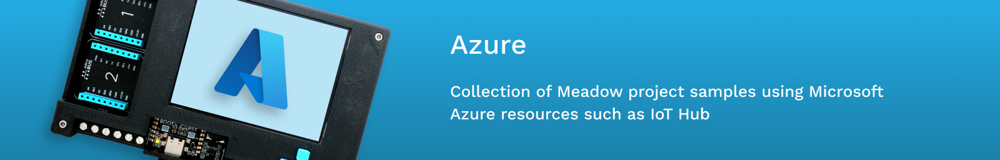](/Source/Azure/)

Meadow project samples using Microsoft Azure. Click on any of these sample project to learn how they work.

<table>
    <tr>
        <td>
             
            Send environmental data to Azure IoT Hub via AMQP or MQTT 
            <a href="https://www.hackster.io/wilderness-labs/send-temperature-humidity-data-from-meadow-to-azure-iot-hub-340b39">Hackster</a> | 
            <a href="Source/Azure/F7Feather_AzureIoTHub/">Source Code</a>
        </td>
        <td>
            <a href="Source/Azure/ProjectLab_AzureIoTHub/">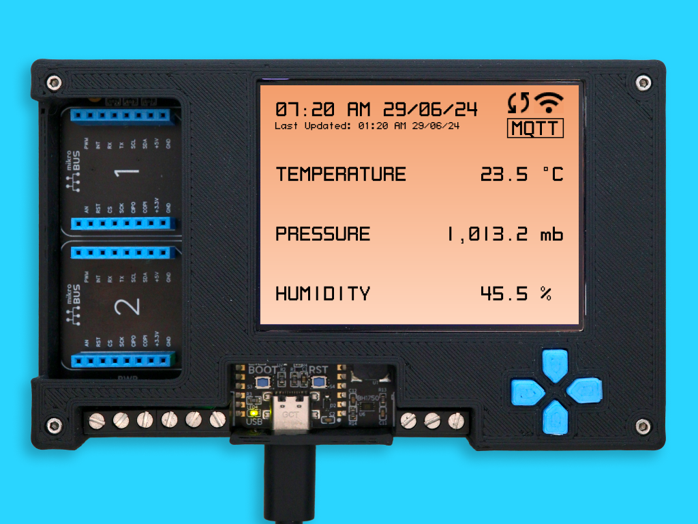</a> 
            Send anvironmental data from a BME688 to Azure IoT Hub 
            <a href="https://www.hackster.io/wildernesslabs/send-environmental-data-from-projectlab-to-azure-w-iot-hub-7d3d07">Hackster</a> | 
            <a href="Source/Azure/ProjectLab_AzureIoTHub/">Source Code</a>
        </td>
        <td>
            <a href="Source/Azure/Web_AzureIoTHub/">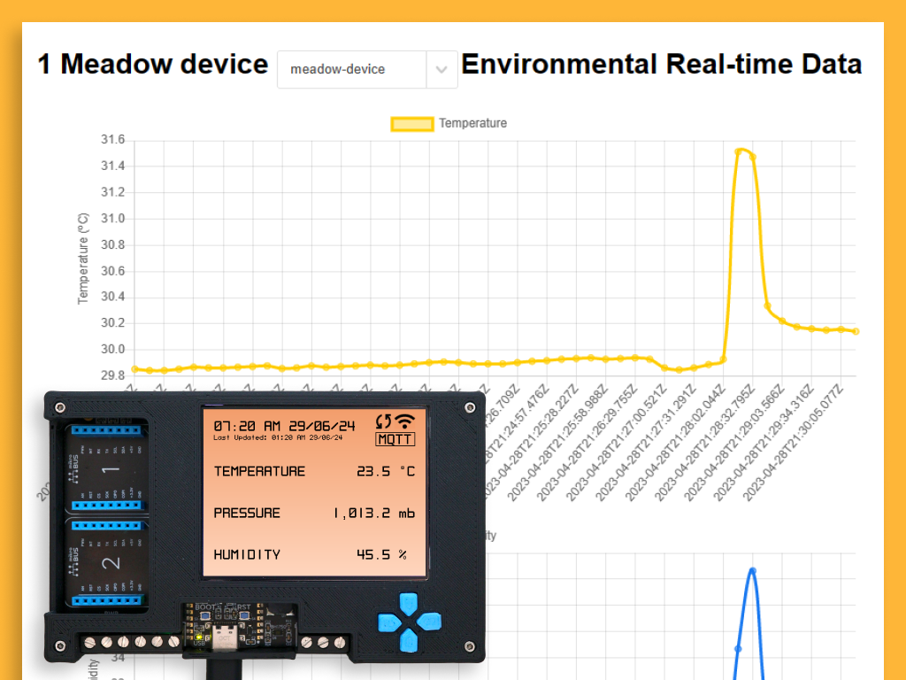</a> 
            Visualize environmental data on a Web App from Azure IoT Hub 
            <a href="https://www.hackster.io/wilderness-labs/visualize-azure-iot-hub-data-with-a-net-web-app-6288e3">Hackster</a> | 
            <a href="Source/Azure/Web_AzureIoTHub/">Source Code</a>
        </td>
    </tr>
    <tr>
        <td>
            
&nbsp;&nbsp;&nbsp;&nbsp;&nbsp;&nbsp;&nbsp;&nbsp;&nbsp;&nbsp;&nbsp;&nbsp;&nbsp;&nbsp;&nbsp;&nbsp;&nbsp;&nbsp;&nbsp;&nbsp;&nbsp;&nbsp;&nbsp;&nbsp;&nbsp;&nbsp;&nbsp;&nbsp;&nbsp;&nbsp;&nbsp;&nbsp;

        </td>
        <td>
            
&nbsp;&nbsp;&nbsp;&nbsp;&nbsp;&nbsp;&nbsp;&nbsp;&nbsp;&nbsp;&nbsp;&nbsp;&nbsp;&nbsp;&nbsp;&nbsp;&nbsp;&nbsp;&nbsp;&nbsp;&nbsp;&nbsp;&nbsp;&nbsp;&nbsp;&nbsp;&nbsp;&nbsp;&nbsp;&nbsp;&nbsp;&nbsp;

        </td>
        <td>
            
&nbsp;&nbsp;&nbsp;&nbsp;&nbsp;&nbsp;&nbsp;&nbsp;&nbsp;&nbsp;&nbsp;&nbsp;&nbsp;&nbsp;&nbsp;&nbsp;&nbsp;&nbsp;&nbsp;&nbsp;&nbsp;&nbsp;&nbsp;&nbsp;&nbsp;&nbsp;&nbsp;&nbsp;&nbsp;&nbsp;&nbsp;&nbsp;

        </td>
    </tr>
</table>

[Back to top](#meadowsamples)

## Project Lab

[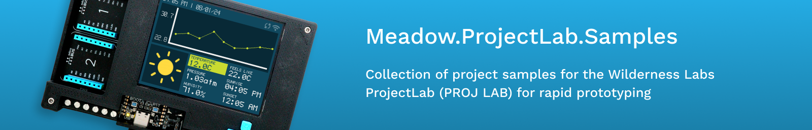](/Source/Meadow.ProjectLab.Samples/)

This repo contains code samples for the Wilderness Labs Meadow [Project Lab](https://github.com/WildernessLabs/Meadow.Project.Lab) board. Project Lab is a hardware development and prototyping board designed to enable rapid prototyping and IoT software development with [Meadow](http://developer.wildernesslabs.co/Meadow/) and [Meadow.Foundation](http://developer.wildernesslabs.co/Meadow/Meadow.Foundation/).

<table>
    <tr>
        <td>
             
            Getting started with Project Lab running a diagnostics app 
            <a href="https://www.hackster.io/wilderness-labs/getting-started-with-meadow-s-project-lab-eeb569">Hackster</a> | 
            <a href="https://github.com/WildernessLabs/Meadow.ProjectLab/tree/main/Source/ProjectLab_Demo">Source Code</a>
        </td>
        <td>
            <a href="Source/ProjectLab/AnalogClockFace/">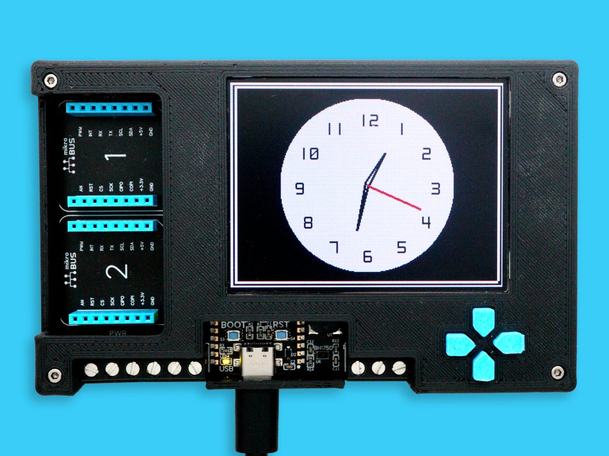</a> 
            Draw a working analog clock watch face using MicroGraphics 
            <a href="Source/ProjectLab/AnalogClockFace/">Source Code</a>
        </td>
        <td>
            <a href="Source/ProjectLab/WifiWeather/">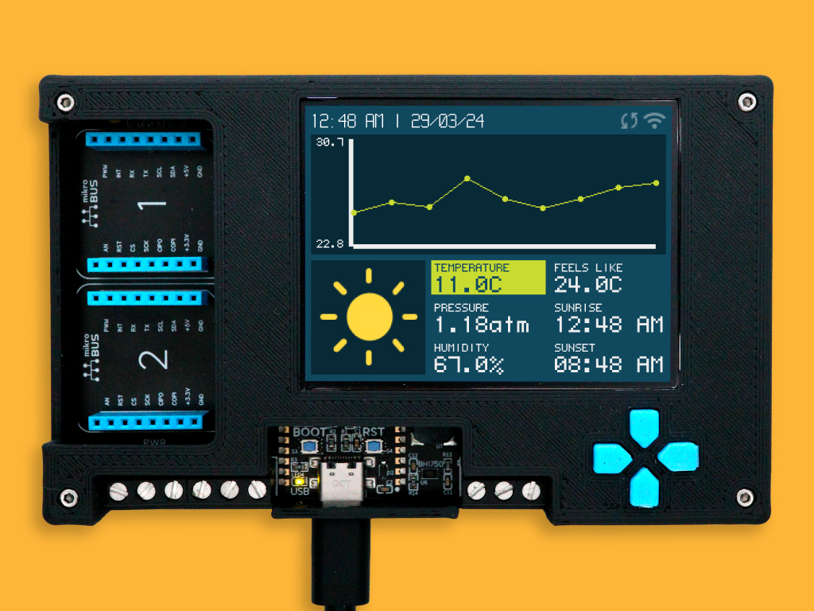</a> 
            Weather Station using public web service on a Project Lab v3 
            <a href="Source/ProjectLab/WifiWeather/">Source Code</a>
        </td>
    </tr>
    </tr>
        <td>
            <a href="Source/ProjectLab/Connectivity/ProjectLabConnectivity/">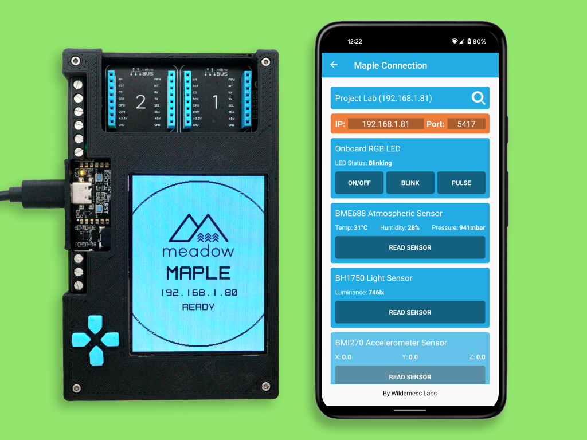</a> 
            Control a Project Lab over Wi-Fi with a MAUI app 
            <a href="Source/ProjectLab/Connectivity/ProjectLabConnectivity/">Source Code</a>
        </td>
        <td>
             
            Control a Project Lab over Bluetooth with a MAUI app 
            <a href="Source/ProjectLab/Connectivity/ProjectLabConnectivity/">Source Code</a>
        </td>
        <td>
             
            Use a Grove Soil Moisture sensor and graph its value on the display 
            <a href="https://www.hackster.io/wilderness-labs/moisturemeter-with-projectlab-and-grove-soil-moisture-sensor-d478fd">Hackster</a> |
            <a href="Source/ProjectLab/MoistureMeter/">Source Code</a>
        </td>
    </tr>
    <tr>
        <td>
             
            Build HMI screens with MicroLayout for Meadow 
            <a href="https://www.hackster.io/wilderness-labs/build-hmi-screens-with-microlayout-for-your-meadow-apps-b87702">Hackster</a> |
            <a href="Source/ProjectLab/MicroLayoutMenu/">Source Code</a>
        </td>
        <td>
            <a href="Source/ProjectLab/AmbientRoomMonitor/">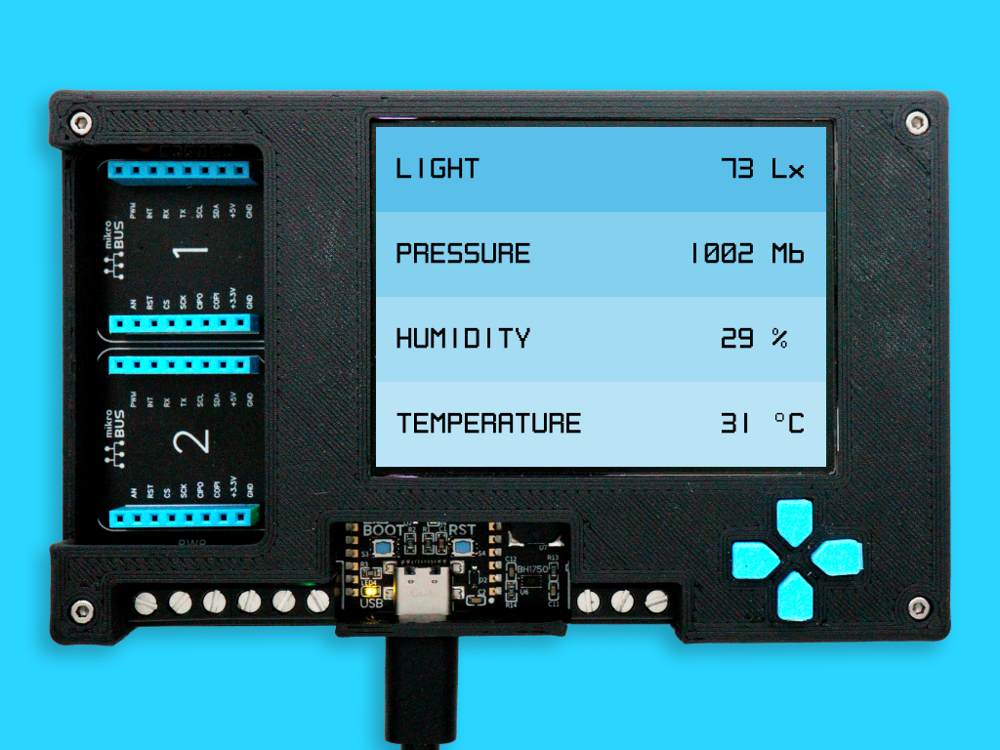</a> 
            Display ambient sensor data with MicroLayout 
            <a href="Source/ProjectLab/AmbientRoomMonitor/">Source Code</a>
        </td>
        <td>
             
            Make a Magic Eight ball with Project Lab 
            <a href="https://www.hackster.io/wilderness-labs/build-your-own-magic-eight-ball-with-a-projectlab-28044f">Hackster</a> | 
            <a href="Source/ProjectLab/MagicEightMeadow/">Source Code</a>
        </td> 
    </tr>
    <tr>
        <td>
            <a href="Source/ProjectLab/GalleryViewer/">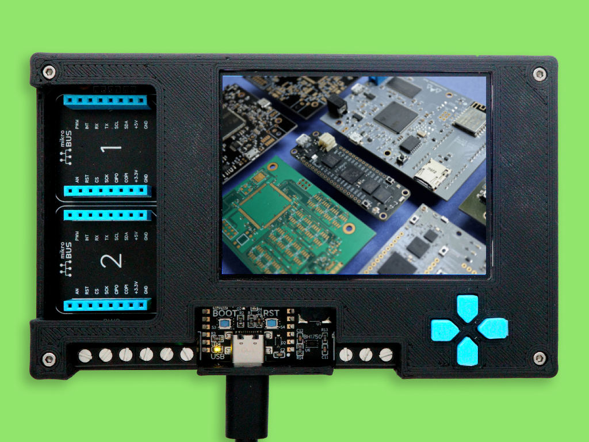</a> 
            Draw JPEG image files using MicroGraphics 
            <a href="Source/ProjectLab/GalleryViewer/">Source Code</a>
        </td>
        <td>
             
            Run a game of Simon on your Project Lab 
            <a href="Source/ProjectLab/Simon/">Source Code</a>
        </td>
        <td>
             
            Train your Morse Code spelling skills with Meadow 
            <a href="Source/ProjectLab/MorseCodeTrainer/">Source Code</a>
        </td>
    </tr>
    <tr>
        <td>
            
&nbsp;&nbsp;&nbsp;&nbsp;&nbsp;&nbsp;&nbsp;&nbsp;&nbsp;&nbsp;&nbsp;&nbsp;&nbsp;&nbsp;&nbsp;&nbsp;&nbsp;&nbsp;&nbsp;&nbsp;&nbsp;&nbsp;&nbsp;&nbsp;&nbsp;&nbsp;&nbsp;&nbsp;&nbsp;&nbsp;&nbsp;&nbsp;

        </td>
        <td>
            
&nbsp;&nbsp;&nbsp;&nbsp;&nbsp;&nbsp;&nbsp;&nbsp;&nbsp;&nbsp;&nbsp;&nbsp;&nbsp;&nbsp;&nbsp;&nbsp;&nbsp;&nbsp;&nbsp;&nbsp;&nbsp;&nbsp;&nbsp;&nbsp;&nbsp;&nbsp;&nbsp;&nbsp;&nbsp;&nbsp;&nbsp;&nbsp;

        </td>
        <td>
            
&nbsp;&nbsp;&nbsp;&nbsp;&nbsp;&nbsp;&nbsp;&nbsp;&nbsp;&nbsp;&nbsp;&nbsp;&nbsp;&nbsp;&nbsp;&nbsp;&nbsp;&nbsp;&nbsp;&nbsp;&nbsp;&nbsp;&nbsp;&nbsp;&nbsp;&nbsp;&nbsp;&nbsp;&nbsp;&nbsp;&nbsp;&nbsp;

        </td>
    </tr>
</table>

[Back to top](#meadowsamples)

## Juego

A collection of samples for the Wilderness Labs [Juego IoT Accelerator](https://github.com/WildernessLabs/Juego), an Open-source, Meadow-powered, multigame handheld console with DPads, speakers and a colored display.

<table>
    <tr>
        <td>
            <a href="https://github.com/WildernessLabs/Juego/tree/main/Source/Juego_Demo">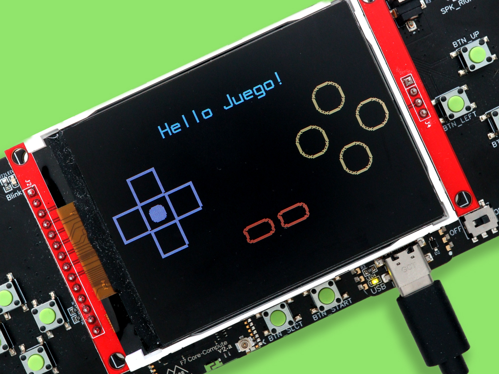</a> 
            Getting started with Juego 
            <a href="https://github.com/WildernessLabs/Juego/tree/main/Source/Juego_Demo">Source Code</a>
        </td>
        <td>
            <a href="Source/Juego/Froggit/">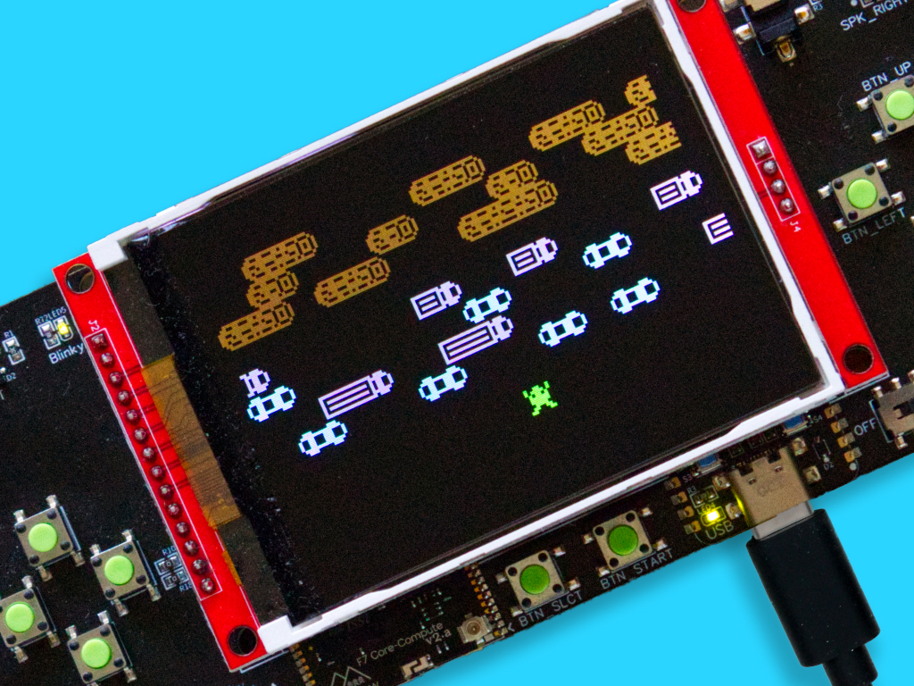</a> 
            Run/play frogger on a Juego 
            <a href="Source/Juego/Froggit/">Source Code</a>
        </td>
        <td>
            <a href="Source/Juego/Tetraminoes/">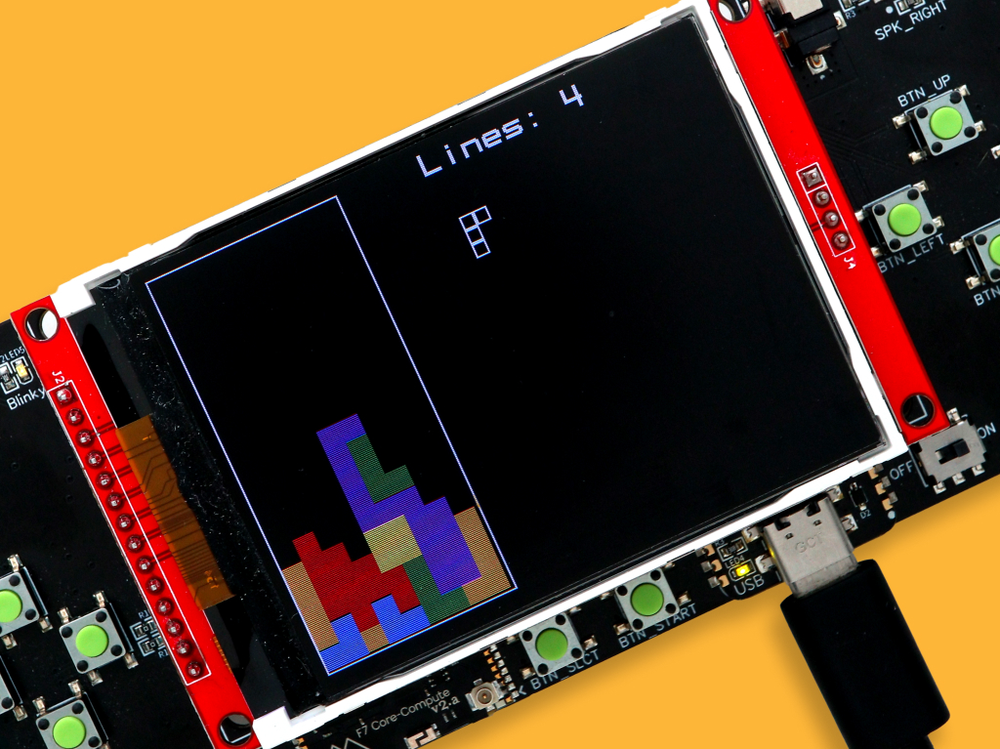</a> 
            Run/play Tetraminoes on a Juego 
            <a href="Source/Juego/Tetraminoes/">Source Code</a>
        </td>
    </tr>
    <tr>
        <td>
             
            Run/play a 2-player Span4 
            <a href="Source/Juego/Span4/">Source Code</a>
        </td>
        <td>
             
            Halloween Eye Ball animation 
            <a href="Source/Juego/Eyeball/">Source Code</a>
        </td>
        <td>
             
            Run/play snake on a Juego 
            <a href="Source/Juego/Snake/">Source Code</a>
        </td> 
    </tr>
    <tr>
        <td>
             
            Falling Sand particles with motion sensor 
            <a href="Source/Juego/FallingSand/">Source Code</a>
        </td>
        <td>
             
            Run a Particle's Game Of Life simulator 
            <a href="Source/Juego/GameOfLife/">Source Code</a>
        </td>
        <td>
             
            Play this traveling through space effect 
            <a href="Source/Juego/Starfield/">Source Code</a>
        </td> 
    </tr>
    <tr>
        <td>
            
&nbsp;&nbsp;&nbsp;&nbsp;&nbsp;&nbsp;&nbsp;&nbsp;&nbsp;&nbsp;&nbsp;&nbsp;&nbsp;&nbsp;&nbsp;&nbsp;&nbsp;&nbsp;&nbsp;&nbsp;&nbsp;&nbsp;&nbsp;&nbsp;&nbsp;&nbsp;&nbsp;&nbsp;&nbsp;&nbsp;&nbsp;&nbsp;

        </td>
        <td>
            
&nbsp;&nbsp;&nbsp;&nbsp;&nbsp;&nbsp;&nbsp;&nbsp;&nbsp;&nbsp;&nbsp;&nbsp;&nbsp;&nbsp;&nbsp;&nbsp;&nbsp;&nbsp;&nbsp;&nbsp;&nbsp;&nbsp;&nbsp;&nbsp;&nbsp;&nbsp;&nbsp;&nbsp;&nbsp;&nbsp;&nbsp;&nbsp;

        </td>
        <td>
            
&nbsp;&nbsp;&nbsp;&nbsp;&nbsp;&nbsp;&nbsp;&nbsp;&nbsp;&nbsp;&nbsp;&nbsp;&nbsp;&nbsp;&nbsp;&nbsp;&nbsp;&nbsp;&nbsp;&nbsp;&nbsp;&nbsp;&nbsp;&nbsp;&nbsp;&nbsp;&nbsp;&nbsp;&nbsp;&nbsp;&nbsp;&nbsp;

        </td>
    </tr>
</table>

[Back to top](#meadowsamples)

## Gnss Sensor Tracker

[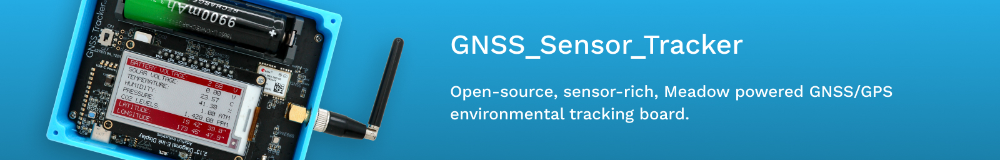](/Source/GnssTracker/)

Meadow project samples with a Gnss Sensor Tracker. Click on any of these sample project to learn how they work.

<table>
    <tr>
        <td>
            <a href="https://github.com/WildernessLabs/GNSS_Sensor_Tracker/tree/main/Source/GnssTracker_Demo">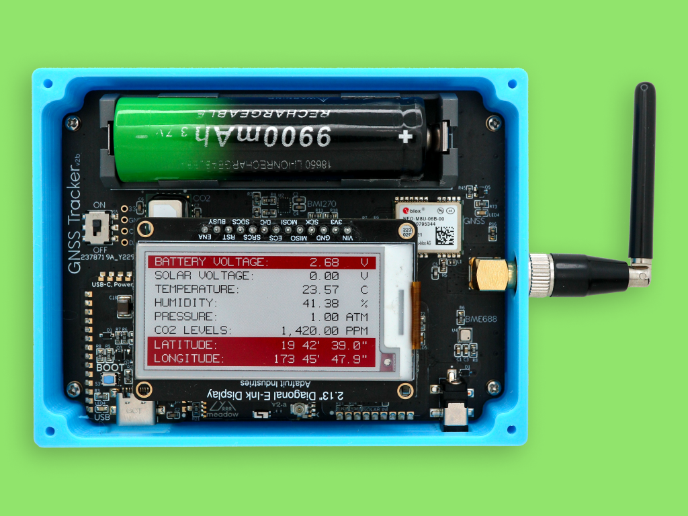</a> 
            Getting started with GNSS Tracker running a diagnostics app 
            <a href="https://github.com/WildernessLabs/GNSS_Sensor_Tracker/tree/main/Source/GnssTracker_Demo">Source Code</a>
        </td>
        <td>
            <a href="Source/GnssTracker/Connectivity/">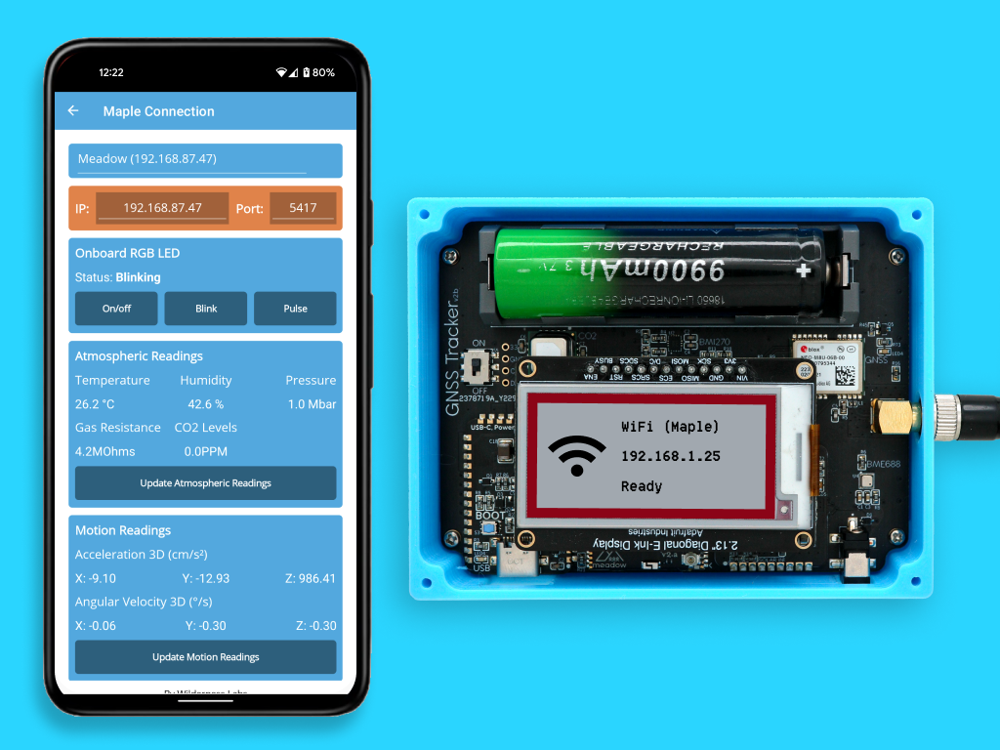</a> 
            Control a GNSS Tracker over Bluetooth with a MAUI app 
            <a href="Source/GnssTracker/Connectivity/">Source Code</a>
        </td>
        <td>
            <a href="Source/GnssTracker/Connectivity/">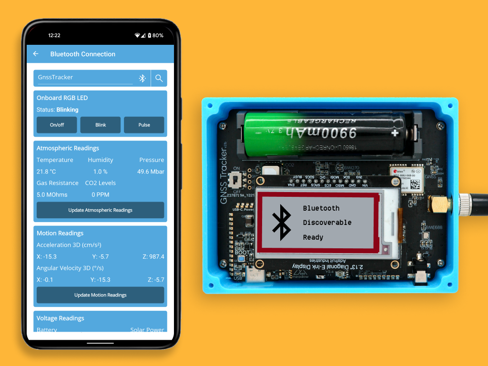</a> 
            Control a GNSS Tracker over WiFi with a MAUI app 
            <a href="Source/GnssTracker/Connectivity/">Source Code</a>
        </td>
    </tr>
    <tr>
        <td>
            
&nbsp;&nbsp;&nbsp;&nbsp;&nbsp;&nbsp;&nbsp;&nbsp;&nbsp;&nbsp;&nbsp;&nbsp;&nbsp;&nbsp;&nbsp;&nbsp;&nbsp;&nbsp;&nbsp;&nbsp;&nbsp;&nbsp;&nbsp;&nbsp;&nbsp;&nbsp;&nbsp;&nbsp;&nbsp;&nbsp;&nbsp;&nbsp;

        </td>
        <td>
            
&nbsp;&nbsp;&nbsp;&nbsp;&nbsp;&nbsp;&nbsp;&nbsp;&nbsp;&nbsp;&nbsp;&nbsp;&nbsp;&nbsp;&nbsp;&nbsp;&nbsp;&nbsp;&nbsp;&nbsp;&nbsp;&nbsp;&nbsp;&nbsp;&nbsp;&nbsp;&nbsp;&nbsp;&nbsp;&nbsp;&nbsp;&nbsp;

        </td>
        <td>
            
&nbsp;&nbsp;&nbsp;&nbsp;&nbsp;&nbsp;&nbsp;&nbsp;&nbsp;&nbsp;&nbsp;&nbsp;&nbsp;&nbsp;&nbsp;&nbsp;&nbsp;&nbsp;&nbsp;&nbsp;&nbsp;&nbsp;&nbsp;&nbsp;&nbsp;&nbsp;&nbsp;&nbsp;&nbsp;&nbsp;&nbsp;&nbsp;

        </td>
    </tr>
</table>

[Back to top](#meadowsamples)

## StartKit

Meadow project samples build with StartKit. Same codebase runs on Meadow F7 devices, Desktop and Single-board-computers such as Raspberry Pi.

<table>
    <tr>
        <td>
            <a href="Source/MultiPlatform/WiFinder/">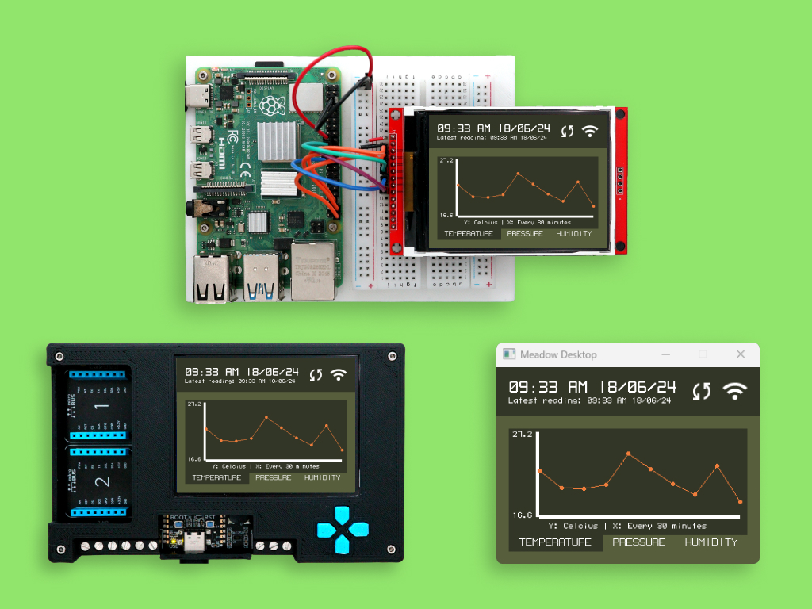</a> 
            Send environmental data to Meadow.Cloud  
            <a href="Source/MultiPlatform/AmbientMonitor/">Source Code</a>
        </td>
        <td>
            <a href="Source/Azure/ProjectLab_AzureIoTHub/">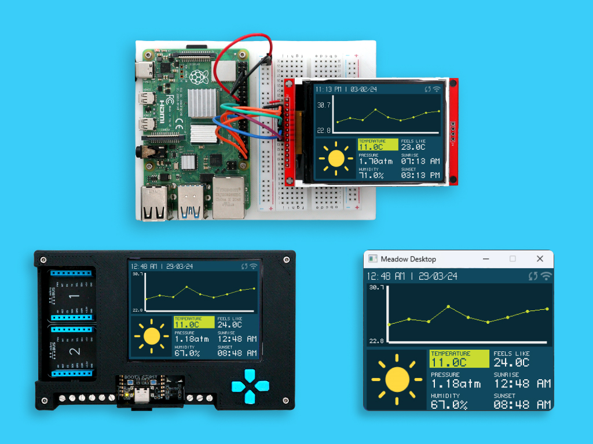</a> 
            Get local weather forecast using Meadow Startkit  
            <a href="Source/MultiPlatform/WifiWeather/">Source Code</a>
        </td>
        <td>
             
            Basic image viewer using Meadow StartKit 
            <a href="Source/MultiPlatform/GalleryViewer/">Source Code</a>
        </td>
    </tr>
    <tr>
        <td>
            
&nbsp;&nbsp;&nbsp;&nbsp;&nbsp;&nbsp;&nbsp;&nbsp;&nbsp;&nbsp;&nbsp;&nbsp;&nbsp;&nbsp;&nbsp;&nbsp;&nbsp;&nbsp;&nbsp;&nbsp;&nbsp;&nbsp;&nbsp;&nbsp;&nbsp;&nbsp;&nbsp;&nbsp;&nbsp;&nbsp;&nbsp;&nbsp;

        </td>
        <td>
            
&nbsp;&nbsp;&nbsp;&nbsp;&nbsp;&nbsp;&nbsp;&nbsp;&nbsp;&nbsp;&nbsp;&nbsp;&nbsp;&nbsp;&nbsp;&nbsp;&nbsp;&nbsp;&nbsp;&nbsp;&nbsp;&nbsp;&nbsp;&nbsp;&nbsp;&nbsp;&nbsp;&nbsp;&nbsp;&nbsp;&nbsp;&nbsp;

        </td>
        <td>
            
&nbsp;&nbsp;&nbsp;&nbsp;&nbsp;&nbsp;&nbsp;&nbsp;&nbsp;&nbsp;&nbsp;&nbsp;&nbsp;&nbsp;&nbsp;&nbsp;&nbsp;&nbsp;&nbsp;&nbsp;&nbsp;&nbsp;&nbsp;&nbsp;&nbsp;&nbsp;&nbsp;&nbsp;&nbsp;&nbsp;&nbsp;&nbsp;

        </td>
    </tr>
</table>

[Back to top](#meadowsamples)

## Support

Having trouble building/running these projects? 
* File an [issue](https://github.com/WildernessLabs/Meadow_Issues/) with a repro case to investigate, and/or
* Join our [public Slack](http://slackinvite.wildernesslabs.co/), where we have an awesome community helping, sharing and building amazing things using Meadow.

[Back to top](#meadowsamples)