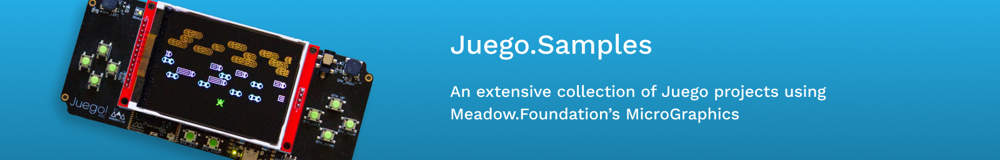
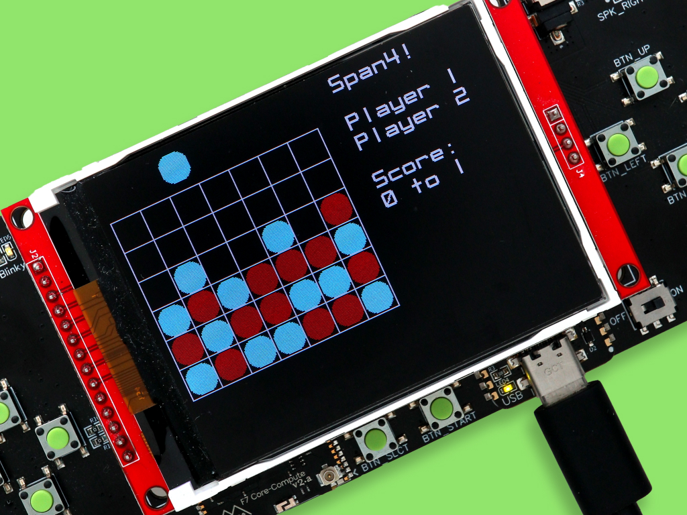
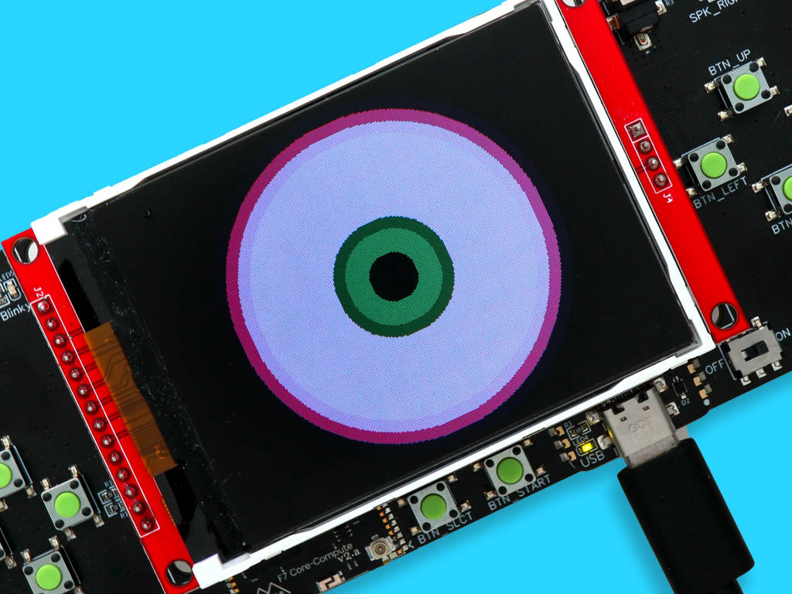
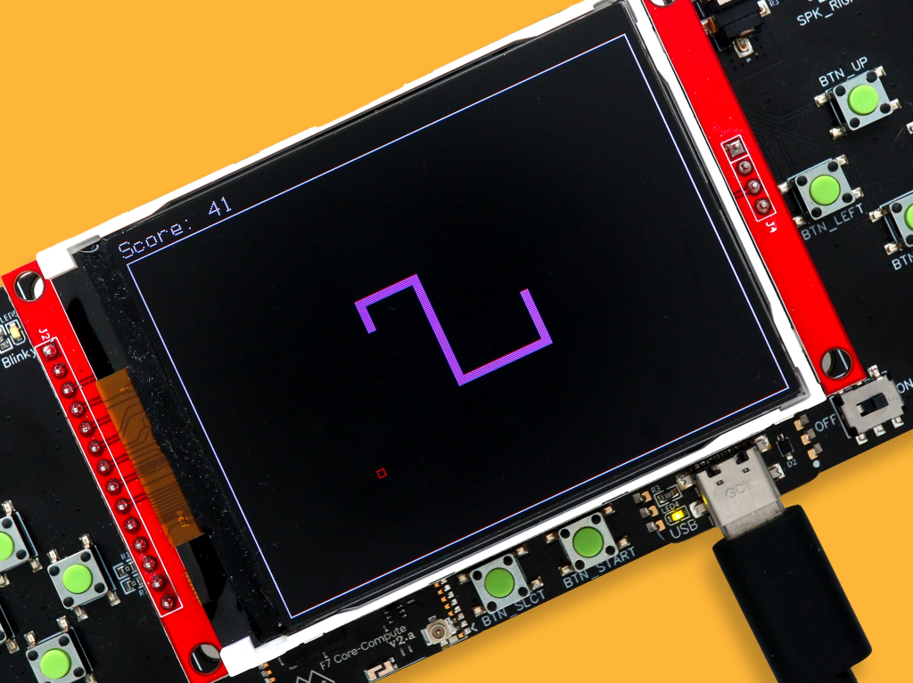

# Juego.Samples

A collection of samples for the Wilderness Labs [Juego IoT Accelerator](https://github.com/WildernessLabs/Juego), an Open-source, Meadow-powered, multigame handheld console with DPads, speakers and a colored display.

## Contents
* [Getting Started](#getting-started)
* [Project Samples](#project-samples)
* [Support](#support)

## Getting Started

Before running any of the Juego samples below, make sure your board is running the latest OS version. We recomment going through our [Meadow OS Deployment](https://developer.wildernesslabs.co/Meadow/Getting_Started/Deploying_Meadow/) guide. 

## Project Samples

<table>
    <tr>
        <td>
             
            Getting started with Juego 
            <a href="https://github.com/WildernessLabs/Juego/tree/main/Source/Juego_Demo">Source Code</a>
        </td>
        <td>
             
            Run/play frogger on a Juego 
            <a href="Source/Froggit/">Source Code</a>
        </td>
        <td>
             
            Run/play Tetraminoes on a Juego 
            <a href="Source/Tetraminoes/">Source Code</a>
        </td>
    </tr>
    <tr>
        <td>
             
            Run/play a 2-player Span4 
            <a href="Source/Span4/">Source Code</a>
        </td>
        <td>
             
            Halloween Eye Ball animation 
            <a href="Source/Eyeball/">Source Code</a>
        </td>
        <td>
             
            Run/play snake on a Juego 
            <a href="Source/Snake/">Source Code</a>
        </td> 
    </tr>
    <tr>
        <td>
            
&nbsp;&nbsp;&nbsp;&nbsp;&nbsp;&nbsp;&nbsp;&nbsp;&nbsp;&nbsp;&nbsp;&nbsp;&nbsp;&nbsp;&nbsp;&nbsp;&nbsp;&nbsp;&nbsp;&nbsp;&nbsp;&nbsp;&nbsp;&nbsp;&nbsp;&nbsp;&nbsp;&nbsp;&nbsp;&nbsp;&nbsp;&nbsp;

        </td>
        <td>
            
&nbsp;&nbsp;&nbsp;&nbsp;&nbsp;&nbsp;&nbsp;&nbsp;&nbsp;&nbsp;&nbsp;&nbsp;&nbsp;&nbsp;&nbsp;&nbsp;&nbsp;&nbsp;&nbsp;&nbsp;&nbsp;&nbsp;&nbsp;&nbsp;&nbsp;&nbsp;&nbsp;&nbsp;&nbsp;&nbsp;&nbsp;&nbsp;

        </td>
        <td>
            
&nbsp;&nbsp;&nbsp;&nbsp;&nbsp;&nbsp;&nbsp;&nbsp;&nbsp;&nbsp;&nbsp;&nbsp;&nbsp;&nbsp;&nbsp;&nbsp;&nbsp;&nbsp;&nbsp;&nbsp;&nbsp;&nbsp;&nbsp;&nbsp;&nbsp;&nbsp;&nbsp;&nbsp;&nbsp;&nbsp;&nbsp;&nbsp;

        </td>
    </tr>
</table>

## Support

Having trouble building/running these projects? 
* File an [issue](https://github.com/WildernessLabs/Meadow.Desktop.Samples/issues) with a repro case to investigate, and/or
* Join our [public Slack](http://slackinvite.wildernesslabs.co/), where we have an awesome community helping, sharing and building amazing things using Meadow.