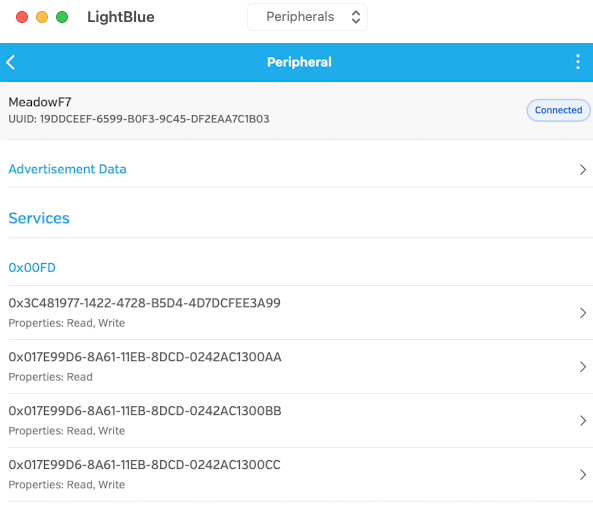
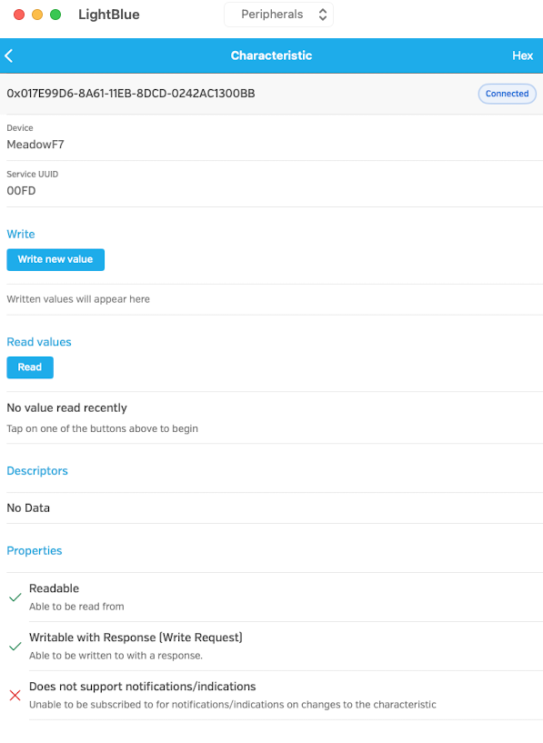
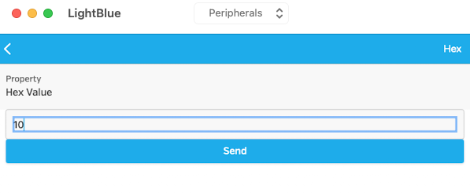
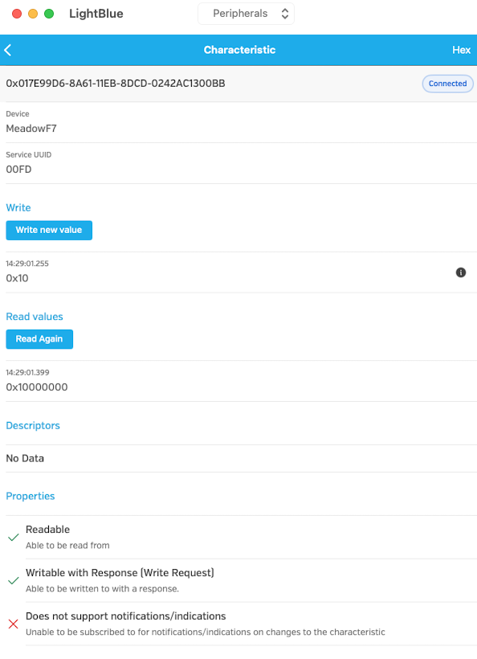

# Bluetooth Basics Example

This example demonstrates how to use a range of characteristics:

* Integer
* Boolean
* Binary Data

as well as showing how to use read only values.

## Description

This application will set up a service with four characteristics with various properties.

## Connecting to Meadow

The application behaviour can be examined using a Bluetooth client application such as LightBlue.  When LightBlue first starts it will display a list of devices detected:

Clicking on the _MeadowF7_ will bring up the list of available characteristics:

Clicking on any of the _Read, Write_ characteristics allows the value to be changed, for example:

Clicking on any of the _Read, Write_ characteristics allows the value to be changed, for example:

Once the value has been written, LightBlue will read the value back and show the value:

