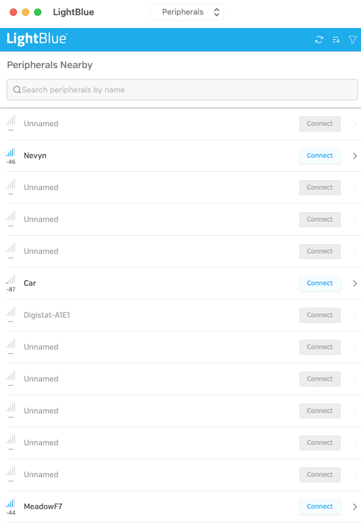

# Bluetooth Notification Characteristic Example

This example demonstrates how to use a notification characteristic.

## Description

This application will set up a service with a single characteristic.  The characteristic will have notification properties meaning the system will notify a connected client each time the characteristic value changes.  The application will set the value from 1 to 60 once per second.

## Connecting to Meadow

The application behaviour can be examined using a Bluetooth client application such as LightBlue.  When LightBlue first starts it will display a list of devices detected:

Clicking on the _MeadowF7_ will bring up the list of available characteristic:

Clicking on the characteristic will present the properties of the characteristic:

Note the characteristic supports subscriptions (notifications).  Clicking on the _Subscribe_ button will show the notifications appearing with the updated values appearing every second for up to 60 seconds.

