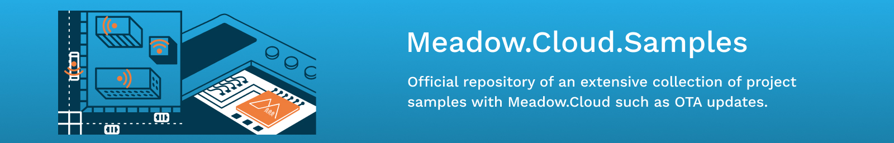

# Meadow.Cloud.Samples

<table>
    </tr>
        <tr>
        <td>
             
            Send an over-the-air update to change colors on an RGB LED 
            <a href="Source/RgbLedUpdateSample/">Source Code</a>
        </td>
        <td>
             
            Send diagnostics logs from Meadow to Meadow.Cloud 
            <a href="Source/CloudLogging/">Source Code</a>
        </td>
        <td>
             
            Check your Meadow's Health Metrics on Meadow.Cloud 
            <a href="Source/HealthMetricsMonitoring/">Source Code</a>
        </td>
    </tr>
    <tr>
        <td>
             
            Send environmental data to Meadow.Cloud using Log Event 
            <a href="Source/Meadow.Cloud_Logging/">Source Code</a>
        </td>
        <td>
             
            Use Meadow.Cloud to push Over-the-air Updates 
            <a href="Source/Meadow.Cloud_OTA/">Source Code</a>
        </td>
        <!--<td>
             
            Get log event data from Meadow.Cloud using its client API 
            <a href="Source/Meadow.Cloud_Client/">Source Code</a>
        </td>-->
        <td>
             
            Use Meadow.Cloud commands to control a four channel relay 
            <a href="Source/Meadow.Cloud_Command/">Source Code</a>
        </td> 
    </tr>
    <tr>
        <td>
            
&nbsp;&nbsp;&nbsp;&nbsp;&nbsp;&nbsp;&nbsp;&nbsp;&nbsp;&nbsp;&nbsp;&nbsp;&nbsp;&nbsp;&nbsp;&nbsp;&nbsp;&nbsp;&nbsp;&nbsp;&nbsp;&nbsp;&nbsp;&nbsp;&nbsp;&nbsp;&nbsp;&nbsp;&nbsp;&nbsp;&nbsp;&nbsp;

        </td>
        <td>
            
&nbsp;&nbsp;&nbsp;&nbsp;&nbsp;&nbsp;&nbsp;&nbsp;&nbsp;&nbsp;&nbsp;&nbsp;&nbsp;&nbsp;&nbsp;&nbsp;&nbsp;&nbsp;&nbsp;&nbsp;&nbsp;&nbsp;&nbsp;&nbsp;&nbsp;&nbsp;&nbsp;&nbsp;&nbsp;&nbsp;&nbsp;&nbsp;

        </td>
        <td>
            
&nbsp;&nbsp;&nbsp;&nbsp;&nbsp;&nbsp;&nbsp;&nbsp;&nbsp;&nbsp;&nbsp;&nbsp;&nbsp;&nbsp;&nbsp;&nbsp;&nbsp;&nbsp;&nbsp;&nbsp;&nbsp;&nbsp;&nbsp;&nbsp;&nbsp;&nbsp;&nbsp;&nbsp;&nbsp;&nbsp;&nbsp;&nbsp;

        </td>
    </tr>
</table>