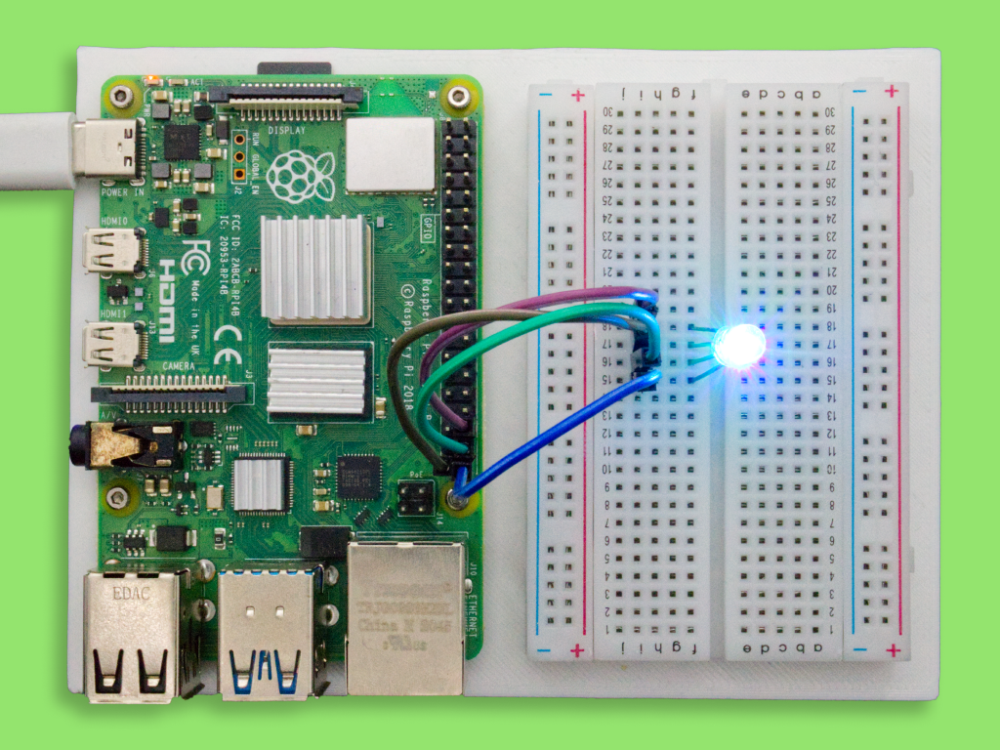

# Meadow.Desktop.Samples

Public project samples for [Meadow.Windows](http://developer.wildernesslabs.co/Meadow/Getting_Started/Getting_Started_Meadow.Desktop/Getting_Started_Windows/) and [Meadow.Linux](http://developer.wildernesslabs.co/Meadow/Getting_Started/Getting_Started_Meadow.Desktop/Getting_Started_Linux/). Click on any of these sample project to learn how they work and run them straight from your Windows machine or Linux device.

## Contents

- [Meadow Linux Samples](#meadowlinux-samples)
- [Linux embedded pinout diagrams](#linux-embedded-pinout-diagrams)
    - [Raspberry Pi 4](#raspberry-pi-4)
- [Support](#support)

## Meadow.Linux Samples

<table>
    <tr>
        <td>
             
            Running Blinky app on a Raspberry Pi with Meadow.Linux 
            <a href="Source/Linux/Blinky/">Source Code</a>
        </td>
        <td>
             
            Using a LCD Display on a Raspberry Pi with Meadow.Linux 
            <a href="Source/Linux/CharacterDisplaySample/">Source Code</a>
        </td>
        <td>
             
            Build a weather widget on a Raspberry Pi w/ Meadow.Linux 
            <a href="Source/Linux/WifiWeather/">Source Code</a>
        </td>
    </tr>
    <tr>
        <td>
            
&nbsp;&nbsp;&nbsp;&nbsp;&nbsp;&nbsp;&nbsp;&nbsp;&nbsp;&nbsp;&nbsp;&nbsp;&nbsp;&nbsp;&nbsp;&nbsp;&nbsp;&nbsp;&nbsp;&nbsp;&nbsp;&nbsp;&nbsp;&nbsp;&nbsp;&nbsp;&nbsp;&nbsp;&nbsp;&nbsp;&nbsp;&nbsp;

        </td>
        <td>
            
&nbsp;&nbsp;&nbsp;&nbsp;&nbsp;&nbsp;&nbsp;&nbsp;&nbsp;&nbsp;&nbsp;&nbsp;&nbsp;&nbsp;&nbsp;&nbsp;&nbsp;&nbsp;&nbsp;&nbsp;&nbsp;&nbsp;&nbsp;&nbsp;&nbsp;&nbsp;&nbsp;&nbsp;&nbsp;&nbsp;&nbsp;&nbsp;

        </td>
        <td>
            
&nbsp;&nbsp;&nbsp;&nbsp;&nbsp;&nbsp;&nbsp;&nbsp;&nbsp;&nbsp;&nbsp;&nbsp;&nbsp;&nbsp;&nbsp;&nbsp;&nbsp;&nbsp;&nbsp;&nbsp;&nbsp;&nbsp;&nbsp;&nbsp;&nbsp;&nbsp;&nbsp;&nbsp;&nbsp;&nbsp;&nbsp;&nbsp;

        </td>
    </tr>
</table>

## Linux embedded pinout diagrams

### Raspberry Pi 4

    

## Support

Having trouble running these samples? 
* File an [issue](https://github.com/WildernessLabs/Meadow.Desktop.Samples/issues) with a repro case to investigate, and/or
* Join our [public Slack](http://slackinvite.wildernesslabs.co/), where we have an awesome community helping, sharing and building amazing things using Meadow.